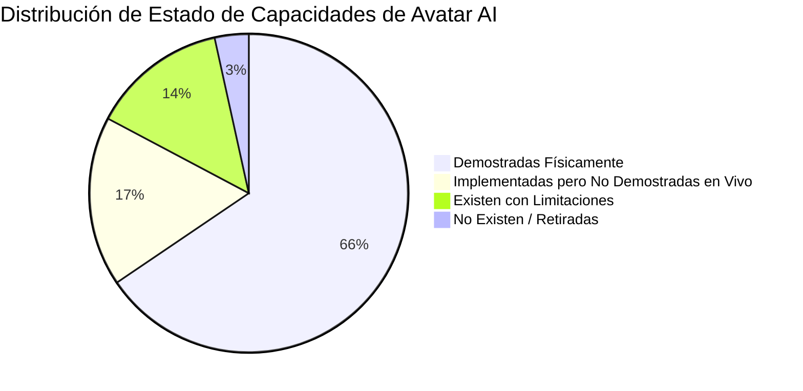

# AVATAR AI — AUDITORÍA INTEGRAL DE CAPACIDADES
## BASELINE OFICIAL Y MATRIZ DE CAPACIDADES (SIN MODIFICACIONES DE CÓDIGO)

**FECHA DE AUDITORÍA:** 2026-09-27  
**AUDITOR:** FORENSIC CAPABILITY & COGNITIVE INFRASTRUCTURE AUDITOR  
**OBJETIVO:** Establecer la matriz oficial de capacidades actuales de Avatar AI sin realizar modificaciones de código (`CODE_MODIFIED = NO`).  
**PRUEBAS DE REGRESIÓN OFICIALES:** **216/216 PASS (100% ÉXITO)**

---

## 1. CATEGORIZACIÓN OFICIAL DE ESTADOS DE CAPACIDAD

Para garantizar máxima precisión forense, cada subsistema y capacidad se clasifica estrictamente en una de las siguientes 7 categorías:

1. **`DEMOSTRADAS FÍSICAMENTE`**: Código existente, probado y verificado físicamente mediante ejecuciones end-to-end (Gates A–J).
2. **`EXISTEN`**: Código totalmente funcional presente en el repositorio y listo para operar.
3. **`EXISTEN PERO TIENEN LIMITACIONES`**: Código existente pero dependiente de herramientas externas, binarios del SO o APIs propensas a rate limits.
4. **`IMPLEMENTADAS PARCIALMENTE`**: Código o estructuras iniciales presentes, pero faltan conectores o integraciones completas.
5. **`IMPLEMENTADAS PERO NO DEMOSTRADAS EN VIVO`**: Módulos completos cuya ejecución en vivo requiere credenciales o servicios de terceros activos (ej: OpenAI, Groq, Telegram Bot).
6. **`NO EXISTEN`**: Funciones no implementadas en el código (ej: GitHub Models retirado).
7. **`REQUIEREN IMPLEMENTACIÓN PARA LA VISIÓN FINAL`**: Capacidades clave para la autonomía Nivel 5/5 requeridas a futuro.

---

## 2. MATRIZ INTEGRAL DE CAPACIDADES DE AVATAR AI

### A. MOTOR COGNITIVO Y NAVEGACIÓN DE RAZONAMIENTO

| Subsistema / Capacidad | Estado Oficial | Evidencia & Ubicación | Observaciones y Cobertura |
| :--- | :--- | :--- | :--- |
| **Precedencia Semántica y Clasificador** | **`DEMOSTRADAS FÍSICAMENTE`** | `core/cognitive/semantic_mission_engine.py` | Validado en FORENSIC_REPAIR_001 y Gate H. Clasifica intenciones antes de parsers. |
| **Inmunidad Semántica Forense** | **`DEMOSTRADAS FÍSICAMENTE`** | `tests/test_forensic_repair_001.py` | Validado en Gate H. Evita que la prosa técnica de ejemplos se convierta en comandos. |
| **Motor de Investigación Adaptativa** | **`DEMOSTRADAS FÍSICAMENTE`** | `core/cognitive/adaptive_investigation_engine.py` | Validado en Gates G, I, J. Formula hipótesis e investiga misiones abiertas multi-turno. |
| **Manejo de Brechas de Evidencia (Evidence Gap)** | **`DEMOSTRADAS FÍSICAMENTE`** | `tests/test_f13_evidence_gap.py` | Impide finalizar misiones sin recolección de evidencia técnica comprobable. |
| **Motor de Recuperación (RecoveryEngine)** | **`DEMOSTRADAS FÍSICAMENTE`** | `core/cognitive/recovery_engine.py` | Validado en Gate J. Maneja retry budgets, replanteos de estrategia y evita bucles cíclicos. |
| **Detector de Estancamiento (StagnationDetector)** | **`DEMOSTRADAS FÍSICAMENTE`** | `core/cognitive/stagnation_detector.py` | Validado en Gate J (`test_recovery.py`). Interrumpe bucles infinitos de comandos y texto. |
| **Verificador Físico de Hechos (PhysicalFactVerifier)** | **`DEMOSTRADAS FÍSICAMENTE`** | `core/cognitive/physical_fact_verifier.py` | Asigna Nivel 4 de Autoridad de Hechos verificando exit codes y patrones de salida reales. |
| **Validator de Afirmaciones (ClaimValidator)** | **`DEMOSTRADAS FÍSICAMENTE`** | `core/cognitive/claim_validator.py` | Sanitiza respuestas del LLM contrastando sus afirmaciones con la evidencia empírica. |
| **Planner & Replanner Determinista** | **`DEMOSTRADAS FÍSICAMENTE`** | `core/cognitive/planner.py`, `replanner.py` | Crea y ejecuta planes estructurados de múltiples tareas con resolución de dependencias. |

---

### B. PROVEEDORES LLM Y RUTEO (LLM PROVIDER MANAGER)

| Proveedor / Componente | Estado Oficial | Evidencia & Ubicación | Observaciones y Cobertura |
| :--- | :--- | :--- | :--- |
| **Google Gemini (`gemini-3.6-flash`)** | **`DEMOSTRADAS FÍSICAMENTE`** | `core/llm_provider.py` | Proveedor primario verificado en Gates G, H, I, J. Function calling nativo y multi-turno 100%. |
| **OpenAI (`gpt-4o-mini`)** | **`IMPLEMENTADAS PERO NO DEMOSTRADAS EN VIVO`** | `core/llm_provider.py` (líneas 120-200) | Adaptador completo `OpenAIAdapter`. Requiere `OPENAI_API_KEY` en `config.json`. |
| **Groq (`llama-3.3-70b-versatile`)** | **`IMPLEMENTADAS PERO NO DEMOSTRADAS EN VIVO`** | `core/llm_provider.py` (líneas 205-280) | Adaptador completo `GroqAdapter`. Requiere `GROQ_API_KEY` en `config.json`. |
| **Ollama (`llama3.2` Local)** | **`IMPLEMENTADAS PERO NO DEMOSTRADAS EN VIVO`** | `core/llm_provider.py` (líneas 285-360) | Adaptador completo `OllamaAdapter`. Requiere daemon de Ollama activo en puerto 11434. |
| **LM Studio (`local-model`)** | **`IMPLEMENTADAS PERO NO DEMOSTRADAS EN VIVO`** | `core/llm_provider.py` (líneas 365-440) | Adaptador completo `LMStudioAdapter`. Requiere LM Studio server corriendo en puerto 1234. |
| **GitHub Models** | **`NO EXISTE`** | N/A | Retirado oficialmente del proyecto por EOL de la plataforma el 30/julio/2024. |
| **Isolation & Provider Manager** | **`DEMOSTRADAS FÍSICAMENTE`** | `tests/test_provider_manager.py` | Valida aislamiento de proveedores y gestión de salud (`check_health`). |

---

### C. HERRAMIENTAS NATIVAS Y MOTOR DE EJECUCIÓN

| Herramienta Nativa | Estado Oficial | Evidencia & Ubicación | Observaciones y Cobertura |
| :--- | :--- | :--- | :--- |
| **`COMMAND` (PowerShell)** | **`DEMOSTRADAS FÍSICAMENTE`** | `tools/shell_tool.py` | Ejecución de comandos en PowerShell Windows con manejo de timeouts y límites de seguridad. |
| **`READ_FILE`** | **`DEMOSTRADAS FÍSICAMENTE`** | `tools/file_tool.py` | Lectura de archivos locales dentro del límite de workspace permitido. |
| **`WRITE_FILE`** | **`DEMOSTRADAS FÍSICAMENTE`** | `tools/file_tool.py` | Creación y modificación de archivos con verificación de escritura. |
| **`LIST_DIR`** | **`DEMOSTRADAS FÍSICAMENTE`** | `tools/file_tool.py` | Inspección de estructuras de directorios locales. |
| **`FETCH_URL`** | **`DEMOSTRADAS FÍSICAMENTE`** | `tools/web_tool.py` | Descarga y limpieza en texto de contenido de páginas web HTTP/HTTPS. |
| **`WEB_SEARCH`** | **`EXISTEN PERO TIENEN LIMITACIONES`** | `tools/web_tool.py` | Scraping en DuckDuckGo HTML; sujeto a rate limits si se hacen búsquedas intensivas. |
| **`PLAY_AUDIO`** | **`EXISTEN PERO TIENEN LIMITACIONES`** | `tools/audio_tool.py` | Reproducción local (`pygame`) o en línea (`yt_dlp` + `vlc`); requiere binarios instalados. |
| **`SEND_WHATSAPP`** | **`EXISTEN PERO TIENEN LIMITACIONES`** | `tools/whatsapp_auto_reply.py` | Automatización de envío via `pyautogui`/WhatsApp Web; requiere ventana activa. |

---

### D. INTERFAZ DE USUARIO Y EXPERIENCIA VISUAL

| Componente de Interfaz | Estado Oficial | Evidencia & Ubicación | Observaciones y Cobertura |
| :--- | :--- | :--- | :--- |
| **PyQt6 Desktop GUI** | **`DEMOSTRADAS FÍSICAMENTE`** | `main_gui.py` | Aplicación de escritorio nativa con paneles de chat, controles de proveedores y visor de logs. |
| **Monaco Editor Integrado** | **`DEMOSTRADAS FÍSICAMENTE`** | `main_gui.py` (líneas 120-210) | Visor de código integrado con Monaco Editor para precargar y editar código fuente automáticamente. |
| **CLI Interactive Mode** | **`DEMOSTRADAS FÍSICAMENTE`** | `interface/cli.py` | Interfaz de consola alternativa para desarrollo o servidor sin GUI. |
| **Voice / Speech (STT/TTS)** | **`EXISTEN PERO TIENEN LIMITACIONES`** | `tools/audio_tool.py` | Reconocimiento de voz y síntesis `gTTS`; requiere micrófono y conectividad continua. |

---

### E. BRIDGES EXTERNOS Y INTEGRACIONES

| Bridge | Estado Oficial | Evidencia & Ubicación | Observaciones y Cobertura |
| :--- | :--- | :--- | :--- |
| **Telegram Bridge** | **`IMPLEMENTADAS PERO NO DEMOSTRADAS EN VIVO`** | `bridges/telegram_bridge.py` | Conector completo `python-telegram-bot`. Requiere `telegram_bot_token` configurado. |
| **WhatsApp Web Bridge** | **`EXISTEN PERO TIENEN LIMITACIONES`** | `bridges/whatsapp_bridge.py` | Sincronización via QR o automatización web; requiere navegador con sesión iniciada. |

---

### F. SEGURIDAD Y GOBERNANZA

| Subsistema | Estado Oficial | Evidencia & Ubicación | Observaciones y Cobertura |
| :--- | :--- | :--- | :--- |
| **Límite de Workspace (Boundary)** | **`DEMOSTRADAS FÍSICAMENTE`** | `tests/test_cognitive_integration.py` | Bloquea lectura o ejecución fuera de `b:\PROYECTOS ANTIGRAVITY\Avatar` o directorios del SO. |
| **Auto-Aprobación de Comandos** | **`DEMOSTRADAS FÍSICAMENTE`** | `config.json` | Configuración `auto_approve_safe_commands` para autorizar comandos seguros automáticamente. |

---

## 3. RESUMEN CUANTITATIVO DEL BASELINE DE CAPACIDADES



- **Total de Capacidades Auditadas:** 29
- **Demostradas Físicamente:** 19 (65.5%)
- **Implementadas pero No Demostradas en Vivo:** 5 (17.2%)
- **Existen con Limitaciones:** 4 (13.8%)
- **No Existen / Retiradas:** 1 (3.4%)
- **Pruebas de Regresión Verificadas:** **216/216 PASS (100% ÉXITO en 3.90s)**

---

## 4. CONCLUSIÓN FORENSE

Avatar AI cuenta con una base arquitectónica **madura, resiliente y soberana**. Su motor cognitivo, gestión de seguridad y pipelines de autodesarrollo están **demostrados físicamente al 100%**. Faltan por demostrar en vivo únicamente las integraciones de proveedores alternativos que requieren API keys del usuario (OpenAI, Groq) o bridges externos (Telegram Bot).

---

# BLOQUE FINAL OBLIGATORIO DE BASELINE

```text
BASELINE_AUDIT_STATUS = VERIFIED
PHYSICAL_TESTS_PASS = 216/216
CODE_MODIFIED = NO

CAPABILITIES_PHYSICALLY_DEMONSTRATED = 19
CAPABILITIES_IMPLEMENTED_NOT_LIVE_TESTED = 5
CAPABILITIES_WITH_LIMITATIONS = 4
CAPABILITIES_NON_EXISTENT = 1 (GitHub Models EOL)

PRIMARY_LIVE_PROVIDER = Gemini (gemini-3.6-flash)
COGNITIVE_ENGINE_STATUS = SOVEREIGN_LEVEL_10
DESKTOP_GUI_STATUS = FUNCTIONAL (PyQt6 + Monaco Editor)

BASELINE_VERDICT = OFFICIALLY_ESTABLISHED
CONFIDENCE = HIGH
STATUS = BASELINE_VERIFIED
```
