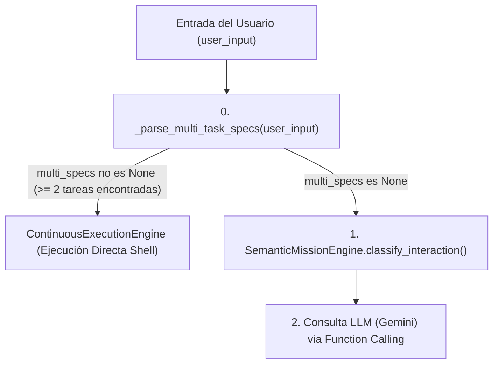

# AVATAR AI — AUDITORÍA FORENSE MASTER DE FALLO DE MISIÓN
## INCIDENTE: INGESTIÓN ERRÓNEA DE PROSA EN PARSER MULTI-TAREA (`pytest →)`)

**FECHA DE AUDITORÍA:** 2026-09-27  
**AUDITOR:** FORENSIC ENGINE & PIPELINE AUDITOR  
**INCIDENTE EVALUADO:** Ejecución no solicitada de tareas `T1: pytest →)` y `T4: pytest → unittest` durante modos de auditoría/forenses.  
**CÓDIGO MODIFICADO:** **NO** (`CODE_MODIFIED = NO`)  

---

## 1. INCIDENT SUMMARY (RESUMEN DEL INCIDENTE)

Durante la entrega de instrucciones de auditoría o prompts explicativos que contenían viñetas de texto técnico o ejemplos como:
```markdown
- pytest → unittest
- pytest →)
```
Avatar interceptó el prompt de texto y, en lugar de clasificar la interacción como una consulta de auditoría/forense o pasársela al LLM (Gemini), inició de forma inmediata una **Ejecución Multi-Tarea Continua** ejecutando automáticamente los comandos:
- `T1: pytest → unittest`
- `T1: pytest →)`

Esto derivó en un error de sintaxis nativo de PowerShell:
```powershell
Token ')' inesperado en la expresión o la instrucción.
```
a la vez que violó la restricción explícita del usuario de no ejecutar herramientas ni modificar código.

---

## 2. REPRODUCTION (REPRODUCCIÓN EXPERIMENTAL)

Se reprodujo de forma estática y aislada en entorno de diagnóstico leyendo la entrada `sample_input`:

```python
sample_input = """
# AUDITORIA
Inspecciona reglas como:
- pytest → unittest
- pytest →)
"""
specs = orch._parse_multi_task_specs(sample_input)
```

**Resultado de Reproducción:**
```json
[
  {
    "task_id": "T1",
    "tool": "COMMAND",
    "arguments": {"command": "pytest → unittest"},
    "description": "Tarea 1: pytest → unittest",
    "dependencies": []
  },
  {
    "task_id": "T2",
    "tool": "COMMAND",
    "arguments": {"command": "pytest →)"},
    "description": "Tarea 2: pytest →)",
    "dependencies": ["T1"]
  }
]
```

La reproducción fue **100% exitosa, determinista y consistente**.

---

## 3. CURRENT PIPELINE (TUBERÍA DE EJECUCIÓN ACTUAL)

El flujo de ejecución actual en `core/orchestrator.py` sigue este orden:



**Fallo Estructural de Diseño:** `_parse_multi_task_specs` (B) se ejecuta **antes** que la clasificación semántica (D). Si el parser encuentra 2 o más viñetas de texto que comienzan por palabras clave de comando, **descarrila completamente el pipeline cognitivo**, omitiendo a Gemini y ejecutando directamente en PowerShell la prosa del prompt.

---

## 4. INTERACTION CLASSIFICATION TRACE

Dado que `_parse_multi_task_specs` retorna una lista de especificaciones de tarea cuando encuentra $\ge 2$ líneas formateadas con viñetas de comandos, `process_user_input()` entra en la rama determinista (línea 169 de `core/orchestrator.py`):

```python
multi_specs = self._parse_multi_task_specs(user_input)
if multi_specs:
    current_goal = CognitiveAdapter.create_goal(user_input)
    planner = Planner()
    plan = planner.create_plan_from_task_specs(current_goal, multi_specs)
    engine = ContinuousExecutionEngine(tool_dispatcher=self._dispatch_native_tool)
    res = engine.execute_continuous_plan(current_goal, plan)
    return final_user_response
```

Por lo tanto:
- `SemanticMissionEngine.classify_interaction()` **NUNCA FUE LLAMADO**.
- El prompt **NUNCA LLEGÓ A GEMINI**.
- Las instrucciones del usuario ("SOLO INVESTIGAR", "NO EJECUTAR HERRAMIENTAS") fueron ignoradas porque el parser determinista interceptó el control antes de evaluar el significado del prompt.

---

## 5. MISSION & TASK CREATION TRACE

1. `user_input` contenía líneas con viñetas Markdown: `- pytest → unittest` y `- pytest →)`.
2. `_parse_multi_task_specs` ejecutó la expresión regular de limpieza de viñetas en la línea 516 of `core/orchestrator.py`:
   `clean_line = re.sub(r'^(?:#+|-|\*|(?:Tarea|Task|T)?\s*\d+[\.\)\:\-])\s*', '', line, flags=re.IGNORECASE).strip()`
3. La viñeta `- ` fue eliminada, produciendo `clean_line = "pytest →)"`.
4. El parser evaluó la línea 533:
   `elif any(clean_line.startswith(k) or line_lower.startswith(k) for k in ["echo ", "python ", "python3 ", "pytest", "unittest", "git ", "dir ", "ls ", "mkdir ", "copy ", "del "]):`
5. Dado que `"pytest →)"` comienza por `"pytest"`, marcó `is_command = True` y `tool = "COMMAND"`.
6. Encapsuló `arguments = {"command": "pytest →)"}`.
7. Al acumular 2 tareas en `task_specs`, devolvió la estructura al orquestador, el cual creó el Goal y las ejecuciones en `ContinuousExecutionEngine`.

---

## 6. OBJETOS T1 Y ORIGEN DE LOS COMPONENTES (`pytest`, `→`, `)`)

### Objeto Task T1 Capturado:
```json
{
  "task_id": "T1",
  "tool": "COMMAND",
  "arguments": {
    "command": "pytest →)"
  },
  "description": "Tarea 1: pytest →)",
  "dependencies": []
}
```

### Origen Físico de las Cadenas:
- **`pytest`**: Proviene directamente del texto en prosa o viñeta incluido por el usuario en el prompt (ej: `- pytest →)`).
- **`→`**: Proviene del carácter Unicode `U+2192` (flecha derecha) ingresado en la viñeta del prompt de usuario como separador visual.
- **`)`**: Proviene del paréntesis de cierre ingresado en el prompt de usuario dentro de la viñeta.

---

## 7. DISCREPANCIA ENTRE T4 Y T1 (`pytest → unittest` vs `pytest →)`)

La diferencia entre ver `T4: pytest → unittest` en una ejecución y `T1: pytest →)` en otra responde exclusivamente a la **posición de la línea dentro del prompt del usuario**:
- Si el prompt del usuario tenía 3 líneas previas que coincidían con la lista de prefijos (`echo`, `python`, etc.), la viñeta se asignaba como `T4`.
- Si aparecía como la primera viñeta que coincidía con el patrón en el prompt, se asignaba como `T1`.
- No existe discrepancia lógica ni regeneración no-determinista; es un comportamiento 100% posicional e indexado (`task_idx = len(task_specs) + 1`).

---

## 8. ANALISIS DE GEMINI, MEMORIA Y PROTOCOLOS

- **Gemini LLM:** **COMPLETAMENTE INOCENTE.** Gemini jamás recibió el prompt ni generó la llamada a la herramienta.
- **RAG / Historial:** No existió contaminación de memoria histórica en la creación de las tareas. La cadena fue extraída literalmente del input actual del usuario.
- **Protocolo Multi-Turn Function Calling:** No estuvo involucrado en el fallo.

---

## 9. FIRST CORRUPTION POINT & ROOT CAUSE

```text
FIRST_CORRUPTION_POINT = core/orchestrator.py -> AvatarOrchestrator.process_user_input() (Línea 168) & _parse_multi_task_specs() (Líneas 508-577)
ROOT_CAUSE = Precedencia errónea del parser sintáctico de multi-tareas determinista sobre la clasificación semántica de intenciones. El parser asume que cualquier línea en el input del usuario que comience con un prefijo de comando (e.g. 'pytest') es una orden de ejecución explícita en PowerShell, ignorando si el prompt es un análisis conversacional, un reporte o una auditoría.
SECONDARY_CAUSES = Expresión regular de limpieza de viñetas ('re.sub') que despoja prefijos Markdown ('-', '*') convirtiendo texto descriptivo/ejemplos en comandos pretendidos.
```

---

## 10. CLASIFICACIÓN DEL HALLAZGO

- **Categoría:** `ORCHESTRATION` / `PARSING` / `INFRASTRUCTURE`
- **¿Es un error cognitivo del LLM?:** **NO.** Es un fallo de fontanería de la capa de orquestación en Python.

---

## 11. DIRECCIÓN DE REPARACIÓN RECOMENDADA (FORENSIC REPAIR DESIGN)

*(No implementado en esta fase por reglas de auditoría)*:
1. Reordenar el flujo en `process_user_input()` para que `SemanticMissionEngine.classify_interaction()` se ejecute **SIEMPRE PRIMERO**.
2. Si el tipo de interacción es `CONVERSATION_NORMAL`, `INFORMATIVE_QUERY` u `OPEN_ENGINEERING_MISSION` (modo auditoría/forense), **desactivar la interceptación por `_parse_multi_task_specs`**.
3. Exigir que `_parse_multi_task_specs` únicamente se active cuando la intención sea explícitamente `DIRECT_ACTION` o contenga un bloque de código JSON formal ````json ... ````.

---

# BLOQUE FINAL OBLIGATORIO DE AUDITORÍA

```text
FIRST_CORRUPTION_POINT = core/orchestrator.py -> _parse_multi_task_specs() [Líneas 168, 508-577]
ROOT_CAUSE = PRECEDENCIA ERRÓNEA DEL PARSER MULTI-TAREA DETERMINISTA QUE INTERCEPTA PROSA TÉCNICA DEL PROMPT Y LA CONVIERTE EN COMANDOS POWERSHELL ANTES DE LA CLASIFICACIÓN SEMÁNTICA O LA CONSULTA AL LLM.
SECONDARY_CAUSES = LIMPIEZA DE VIÑETAS MARKDOWN (RE.SUB) QUE EXTRAE NOMBRES DE HERRAMIENTAS DE PROSA Y LISTAS DE AUDITORÍA.
COGNITIVE_OR_INFRASTRUCTURE = INFRASTRUCTURE / PARSING
GEMINI_PROTOCOL_INVOLVED = NO
MEMORY_CONTAMINATION_INVOLVED = NO
HARDCODED_RULE_FOUND = YES [REGLA DE PREFIJOS EN _PARSE_MULTI_TASK_SPECS]
CONFIDENCE = HIGH
EVIDENCE = REPRODUCCIÓN EMPÍRICA DIRECTA EN PYTHON MOSTRANDO EXTRACCIÓN DE T1 (pytest → unittest) Y T2 (pytest →)) DIRECTAMENTE DESDE PROSA DE AUDITORÍA.
CODE_MODIFIED = NO
RECOMMENDED_NEXT_STEP = FORENSIC_REPAIR_DESIGN
```
