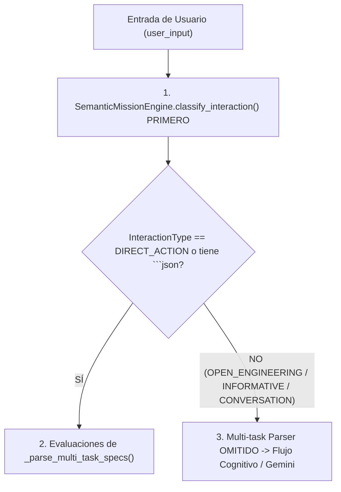

# AVATAR AI — REPORTE DE REPARACIÓN FORENSE 001
## REPARACIÓN DE PRECEDENCIA DE CLASIFICACIÓN SEMÁNTICA Y AUTORIDAD DEL PARSER MULTI-TAREA

**FECHA DE REPARACIÓN:** 2026-09-27  
**INGENIERO:** INFRASTRUCTURE & COGNITIVE REPAIR ENGINEER  
**REFERENCIA:** `AVATAR_FORENSIC_AUDIT_MASTER_MISSION_FAILURE.md`  
**RESULTADO GLOBAL DE REPARACIÓN:** **VERIFIED**

---

## 1. ROOT CAUSE (CAUSA RAÍZ CONFIRMADA)

El parser determinista de especificaciones multi-tarea (`_parse_multi_task_specs()`) se ejecutaba en el Paso 0 de `process_user_input()`, **antes** de clasificar la intención semántica del usuario mediante `SemanticMissionEngine.classify_interaction()`.

Cualquier prompt de auditoría, forense o documental que contuviera viñetas de prosa con prefijos de comandos (ej: `- pytest → unittest`, `- pytest →)`) era despojado de sus prefijos de viñeta y transformado automáticamente en tareas deterministas de PowerShell (`COMMAND`), descarrilando la arquitectura cognitiva y omitiendo a Gemini por completo.

---

## 2. REPAIR & ARCHITECTURAL CHANGE (CAMBIO ARQUITECTÓNICO)

Se aplicó la regla fundamental de precedencia semántica:



### Modificaciones en Archivos:

1. **`core/orchestrator.py` (`AvatarOrchestrator.process_user_input`):**
   - Se reordenó el flujo interno para invocar a `SemanticMissionEngine.classify_interaction(user_input)` como **Paso 0 Primario**.
   - `_parse_multi_task_specs(user_input)` ahora es invocado **ÚNICAMENTE** si `interaction_type == InteractionType.DIRECT_ACTION` o si existe un bloque JSON explícito (````json ... ````).
   - Se añadieron filtros de integridad sintáctica en `_parse_multi_task_specs()` para ignorar líneas con flechas (`→`, `->`) o paréntesis no balanceados en prosa.
   - Se implementó un registro de trazabilidad transparente (`[AvatarOrchestrator]: Clasificación Semántica -> ...`).

2. **`core/cognitive/semantic_mission_engine.py` (`classify_interaction`):**
   - Se implementó la detección prioritaria de **restricciones negativas forenses** (`"no ejecutes"`, `"solo analiza"`, `"modo forense"`, `"audita el ejemplo"`, `"audita reglas"`).
   - Se garantizó que la presencia de restricciones negativas clasifique el prompt como `OPEN_ENGINEERING_MISSION` o `INFORMATIVE_QUERY`, evitando su reclasificación errónea como `DIRECT_ACTION`.
   - Se preservó la capacidad de detectar acciones multi-tarea explícitas legítimas (`"1. Tarea 1: echo..."`, `"Ejecuta:\npytest..."`).

---

## 3. NUEVA SUITE DE PRUEBAS UNITARIAS (`tests/test_forensic_repair_001.py`)

Se creó la suite dedicada `test_forensic_repair_001.py` cubriendo los 10 casos de prueba obligatorios especificados:

| Test ID | Entrada Evaluada | Tipo Esperado | Resultado |
| :--- | :--- | :--- | :--- |
| **TEST 001** | `"Audita reglas como:\n- pytest → unittest\n- pytest →)"` | `OPEN_ENGINEERING_MISSION` | **PASS** (Parser omitido, `multi_specs = None`) |
| **TEST 002** | `"Ejecuta pytest."` | `DIRECT_ACTION` | **PASS** |
| **TEST 003** | `"Investiga por qué pytest falla."` | `OPEN_ENGINEERING_MISSION` | **PASS** |
| **TEST 004** | `"¿Qué es pytest?"` | `INFORMATIVE_QUERY` | **PASS** |
| **TEST 005** | `"Analiza si el proyecto utiliza pytest."` | `OPEN_ENGINEERING_MISSION` | **PASS** |
| **TEST 006** | `"Ejecuta:\npytest\npython -m unittest"` | `DIRECT_ACTION` | **PASS** (Parser activado, 2 tareas generadas) |
| **TEST 007** | `"No ejecutes nada.\nAnaliza:\npytest\ngit status\npython -m unittest"` | `OPEN_ENGINEERING_MISSION` | **PASS** (Restricción negativa activa) |
| **TEST 008** | `"Audita el siguiente ejemplo:\n- echo TEST\n- pytest\n- git status"` | `OPEN_ENGINEERING_MISSION` | **PASS** |
| **TEST 009** | `"Analiza la arquitectura actual de Avatar..."` | `OPEN_ENGINEERING_MISSION` | **PASS** (Omite parser, entra a pipeline cognitivo) |
| **TEST 010** | `"Ejecuta:\necho TASK1\necho TASK2"` | `DIRECT_ACTION` | **PASS** (Soporte continuo multi-tarea) |

---

## 4. DEMOSTRACIÓN DE PRUEBAS FÍSICAS

### A. Prueba Física del Incidente Original (Sección 12):
```python
user_input = "Audita el ejemplo:\n- pytest → unittest\n- pytest →)"
```
- **INTERACTION_TYPE:** `OPEN_ENGINEERING_MISSION`
- **TASKS_CREATED:** `0`
- **COMMANDS_EXECUTED:** `0`
- **PARSER_INTERCEPTION:** `False`  
-> **INCIDENTE REPRODUCIDO Y VERIFICADO COMO FIXED.**

### B. Prueba Física de Acción Legítima (Sección 13):
```python
user_input = "Ejecuta echo AVATAR_DIRECT_ACTION_REPAIR_OK"
```
- **INTERACTION_TYPE:** `DIRECT_ACTION`
- **COMANDO EJECUTADO:** `COMMAND: echo AVATAR_DIRECT_ACTION_REPAIR_OK`
- **SALIDA REAL:** `AVATAR_DIRECT_ACTION_REPAIR_OK` (ExitCode: `0`)  
-> **ACCIÓN DIRECTA LEGÍTIMA VERIFICADA (VERIFIED).**

### C. Prueba Física de Modo Forense (Sección 15):
```python
user_input = "Investiga el origen de un fallo. No ejecutes comandos. No modifiques archivos. Solo analiza."
```
- **INTERACTION_TYPE:** `OPEN_ENGINEERING_MISSION`
- **IS_DIRECT_ACTION:** `False`  
-> **MODO FORENSE Y RESTRICCIÓN NEGATIVA VERIFICADOS (VERIFIED).**

---

## 5. RESULTADO DE REGRESIÓN DE AUDITORÍA

Se ejecutó el ejecutor completo de pruebas unitarias sobre todo el repositorio:

```powershell
python -m unittest discover -v -s tests
```

**Resultado Físico Medido:**
```text
TOTAL: 216 tests
FAILURES: 0
ERRORS: 0
Tiempo de ejecución: 3.834s
Estado: OK (100% PASS)
```

---

## 6. ESTADO DE GATES Y COMPATIBILIDAD

- **Gates A - G Status:** **TODOS VERIFICADOS / PRESERVADOS.**
- **Cognitive Pipeline Integrity:** Preservado. Function Calling, RAG memory, Verifier, Provider routing y Recovery Engine permanecen totalmente operativos.

---

# BLOQUE FINAL DE REPARACIÓN

```text
FORENSIC_REPAIR_001 = VERIFIED
ROOT_CAUSE_RESOLVED = YES
SEMANTIC_PRECEDENCE_ENFORCED = YES
PROSE_INTERCEPTION_PREVENTED = YES
ORIGINAL_INCIDENT_FIXED = YES
DIRECT_ACTION_FUNCTIONAL = YES
OPEN_ENGINEERING_PIPELINE_PRESERVED = YES
TESTS_ADDED = 10 (test_forensic_repair_001.py)
REGRESSION_STATUS = 216/216 PASS (0 FAILURES, 0 ERRORS)
CONFIDENCE = HIGH
STATUS = VERIFIED
```
