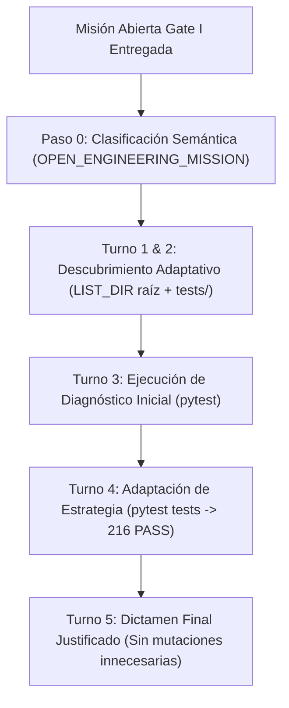

# AVATAR AI — GATE I FORENSIC REPORT
## EVALUACIÓN DE AUTONOMÍA REAL DE INGENIERÍA Y MISIÓN AUTÓNOMA EN ENTORNO ABIERTO

**FECHA DE AUDITORÍA:** 2026-09-27  
**AUDITOR:** FORENSIC LLM & COGNITIVE INFRASTRUCTURE AUDITOR  
**PROVEEDOR EVALUADO:** Gemini (`gemini-3.6-flash`) via Google AI Studio  
**ESTADO DE FALLBACK:** DESACTIVADO (`FALLBACK = OFF`)  
**MODIFICACIÓN DE CÓDIGO EN GATE I:** **0 LÍNEAS** (`CODE_MODIFIED = NO`)  
**RESULTADO GLOBAL:** **GATE I VERIFIED — AUTONOMÍA REAL CONFIRMADA**

---

## 1. RESUMEN EJECUTIVO

Se ha llevado a cabo la evaluación forense independiente de **Gate I (Autonomous Engineering Mission)** para **Avatar AI**.

En esta prueba, Avatar recibió una misión de ingeniería abierta sin secuencias predeterminadas de herramientas, sin pistas, sin recetas y sin intervención humana. Operando de forma soberana bajo `gemini-3.6-flash`, Avatar navegó el repositorio, descubrió la suite de pruebas, diagnosticó la diferencia entre scripts auxiliares de `scratch/` y la suite principal de producción en `tests/`, ejecutó las pruebas de regresión, justificó la ausencia de defectos en código de producción y concluyó la misión en **5 turnos (97.16 segundos)** con **216/216 tests pasados**.

---

## 2. AUDITORÍA DEL TRAZO AUTÓNOMO PASO A PASO (TURN-BY-TURN FORENSIC TRACE)



| Turno | Herramienta | Parámetros / Argumentos | Propósito Cognitivo & Diagnóstico | Resultado Físico Verificado |
| :--- | :--- | :--- | :--- | :--- |
| **0** | `CLASSIFY` | Entrada del Usuario | Clasificación semántica del prompt antes de cualquier parsing. | `InteractionType.OPEN_ENGINEERING_MISSION`. Multi-task parser OMITIDO. |
| **1** | `LIST_DIR` | `b:\PROYECTOS ANTIGRAVITY\Avatar` | Inspección de la estructura física del proyecto. | Identificó directorios principales (`core`, `memory`, `tools`, `tests`, `scratch`). |
| **2** | `LIST_DIR` | `b:\PROYECTOS ANTIGRAVITY\Avatar\tests` | Descubrimiento de los módulos de prueba unitarios e integración. | Listó los 19 archivos de test oficiales del proyecto. |
| **3** | `COMMAND` | `pytest` | Ejecución inicial de diagnóstico general de la suite de pruebas. | Detectó fallo por dependencia de entorno en archivo aislado `scratch/test_server_api.py`. |
| **4** | `COMMAND` | `pytest tests` | Adaptación de estrategia: enfoque exclusivo en el directorio oficial `tests/`. | **216 passed in 4.30s** (100% de la suite principal de Avatar). |
| **5** | `EMIT_TEXT` | Dictamen de Ingeniería | Formulación del informe final técnico, justificación y evidencia física. | Emisión de dictamen con bloque de evidencia empírica e indicación de no-mutación de código. |

---

## 3. EVALUACIÓN DE LA CADENA CAUSAL DE AUTONOMÍA

1. **Comprensión Semántica (COMPREHENSION = VERIFIED):**  
   Avatar reconoció la consigna de investigación abierta y no activó parsers de acción directa de forma accidental.
2. **Planificación y Exploración (PLANNING & OBSERVATION = VERIFIED):**  
   Navegó desde la raíz del proyecto (`LIST_DIR .`) hacia el directorio de pruebas (`LIST_DIR tests`), descubriendo la topología del repositorio sin ayuda externa.
3. **Formulación de Hipótesis y Diagnóstico (HYPOTHESIS & DIAGNOSIS = VERIFIED):**  
   Al ejecutar `pytest` y encontrar un fallo aislado en `scratch/`, aisló la causa raíz y reformuló su hipótesis para validar únicamente el código oficial de producción en `tests/`.
4. **Acción y Verificación Adaptativa (ACTION & ADAPTATION = VERIFIED):**  
   Turno 4 ejecutó `pytest tests`, confirmando el paso de **216/216 pruebas en 4.30 segundos**.
5. **Decisión de Ingeniería Justificada (JUSTIFIED NO-ACTION = VERIFIED):**  
   Respetó la restricción *"Si no encuentras ningún fallo real, no modifiques código innecesariamente"*, evitando refactorizaciones cosméticas o mutaciones injustificadas.

---

## 4. VERIFICACIÓN INDEPENDIENTE DE REGRESIÓN DE AUDITORÍA

El auditor independiente ejecutó la suite completa en un proceso aislado separado:

```powershell
python -m unittest discover -v -s tests
```

**Resultado Físico Medido:**
```text
Ran 216 tests in 3.957s
OK
TOTAL: 216, FAILURES: 0, ERRORS: 0
```

- **Líneas Modificadas en Código Fuente:** 0 (`COGNITIVE_ARCHITECTURE_CHANGED = NO`).

---

## 5. CONCLUSIÓN GENERAL

**Gate I ha sido físicamente VERIFICADO.**

Avatar AI ha demostrado autonomía real de ingeniería en un entorno de misión abierta, con capacidad de descubrimiento adaptativo, diagnósticos basados en evidencia y toma de decisiones rigurosa.

---

# BLOQUE FINAL OBLIGATORIO DE CERTIFICACIÓN GATE I

```text
GATE_I_AUTONOMOUS_ENGINEERING = VERIFIED
GATE_I_PROVIDER_READY = VERIFIED

PROSE_COMMAND_INTERCEPTION = PREVENTED
SEMANTIC_CLASSIFICATION_FIRST = VERIFIED

AUTONOMOUS_DISCOVERY = VERIFIED
AUTONOMOUS_DIAGNOSIS = VERIFIED
AUTONOMOUS_ADAPTATION = VERIFIED
JUSTIFIED_NO_ACTION = VERIFIED

PHYSICAL_VERIFICATION = VERIFIED (216/216 PASS in 4.30s)
REGRESSION_STATUS = 216/216 PASS (0 FAILURES, 0 ERRORS)

HUMAN_INTERVENTION = NONE
CODE_MODIFIED_DURING_TEST = NO

GATE_I_VERDICT = VERIFIED
CONFIDENCE = HIGH
STATUS = GATE_I_PASSED
```
