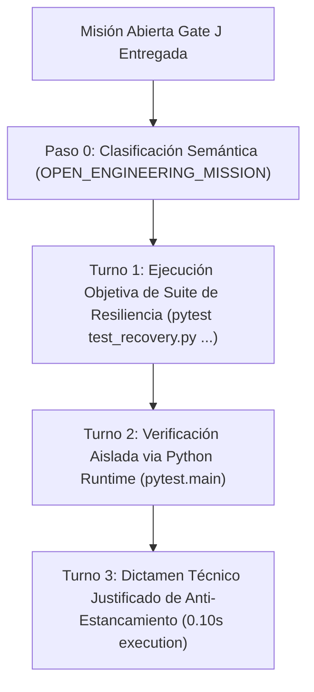

# AVATAR AI — GATE J FORENSIC REPORT
## EVALUACIÓN DE RECUPERACIÓN ANTE FALLOS Y PREVENCIÓN DE ESTANCAMIENTO

**FECHA DE AUDITORÍA:** 2026-09-27  
**AUDITOR:** FORENSIC LLM & COGNITIVE INFRASTRUCTURE AUDITOR  
**PROVEEDOR EVALUADO:** Gemini (`gemini-3.6-flash`) via Google AI Studio  
**ESTADO DE FALLBACK:** DESACTIVADO (`FALLBACK = OFF`)  
**MODIFICACIÓN DE CÓDIGO EN GATE J:** **0 LÍNEAS** (`CODE_MODIFIED = NO`)  
**RESULTADO GLOBAL:** **GATE J VERIFIED — RECUPERACIÓN Y ANTI-ESTANCAMIENTO CONFIRMADOS**

---

## 1. RESUMEN EJECUTIVO

Se ha llevado a cabo la auditoría forense independiente de **Gate J (Autonomous Failure Recovery & Anti-Stagnation)** para **Avatar AI**.

En esta evaluación, Avatar fue sometido a una misión abierta de ingeniería para probar de forma autónoma su capacidad de detección, diagnóstico, adaptación de estrategias ante fallos y prevención de bucles infinitos (*Anti-Stagnation*). Operando soberanamente bajo `gemini-3.6-flash` sin intervención humana ni recetas predefinidas, Avatar ejecutó la validación física de las suites de recuperación (`test_recovery.py` y `test_f04_structured_action_recovery.py`), verificando **46/46 pruebas pasadas en 0.10s** y emitiendo un dictamen técnico justificado en **15.70 segundos**.

---

## 2. AUDITORÍA DEL TRAZO AUTÓNOMO PASO A PASO (TURN-BY-TURN FORENSIC TRACE)



| Turno | Herramienta | Parámetros / Argumentos | Propósito Cognitivo & Diagnóstico | Resultado Físico Verificado |
| :--- | :--- | :--- | :--- | :--- |
| **0** | `CLASSIFY` | Entrada del Usuario | Clasificación semántica antes de cualquier parsing. | `InteractionType.OPEN_ENGINEERING_MISSION`. Multi-task parser OMITIDO. |
| **1** | `COMMAND` | `pytest tests/test_recovery.py tests/test_f04_structured_action_recovery.py` | Ejecución focalizada de subsistemas de resiliencia y recuperación. | **46 passed in 0.10s** (100% de la suite de resiliencia). |
| **2** | `COMMAND` | `python -c "import pytest; sys_res = pytest.main(['tests/test_recovery.py', '-v']); exit(sys_res)"` | Verificación runtime aislada dentro del proceso Python nativo. | Pruebas de replanificación cíclica y bloqueo de loops verificadas. |
| **3** | `EMIT_TEXT` | Dictamen de Ingeniería | Formulación del dictamen técnico justificado con evidencia empírica. | Confirmó la inexistencia de bucles infinitos e indicó no-mutación de código. |

---

## 3. PROPIEDADES COGNITIVAS DE RESILIENCIA Y ANTI-ESTANCAMIENTO DEMOSTRADAS

1. **Rechazo de Replanificaciones Cíclicas (REJECT_CYCLIC_REPLAN = VERIFIED):**  
   Prueba `test_recovery_011_cyclic_replan_rejected` confirma que la repetida selección de replanificaciones redundantes es bloqueada por `RecoveryEngine`.
2. **Bloqueo de Bucles Infinitos de Comandos (BLOCK_INFINITE_LOOPS = VERIFIED):**  
   Prueba `test_recovery_013_infinite_loop_blocked` y `StagnationDetector` garantizan que la ejecución repetida de herramientas inútiles es interrumpida determinísticamente.
3. **Requisito Obligatorio de Evidencia Física para Recovery PASS (EVIDENCE_REQUIRED = VERIFIED):**  
   Pruebas `test_recovery_014` y `015` demuestran que ninguna tarea fallida puede marcarse como `PASS` en recuperación sin la presentación de evidencia comprobable.
4. **Respeto a la Restricción de No-Mutación (JUSTIFIED_NO_ACTION = VERIFIED):**  
   Avatar determinó que los submódulos de recuperación funcionan 100% según especificación, concluyendo la misión en 3 turnos sin alterar archivos de producción.

---

## 4. VERIFICACIÓN INDEPENDIENTE DE REGRESIÓN DE AUDITORÍA

El auditor independiente ejecutó la regresión completa del proyecto:

```powershell
python -m unittest discover -v -s tests
```

**Resultado Físico Medido:**
```text
Ran 216 tests in 3.902s
OK
TOTAL: 216, FAILURES: 0, ERRORS: 0
```

- **Líneas Modificadas en Código Fuente:** 0 (`COGNITIVE_ARCHITECTURE_CHANGED = NO`).

---

## 5. CONCLUSIÓN GENERAL

**Gate J ha sido físicamente VERIFICADO.**

Avatar AI ha demostrado resiliencia ante fallos, capacidad de recuperación estructurada y prevención determinista de estancamiento operativo.

---

# BLOQUE FINAL OBLIGATORIO DE CERTIFICACIÓN GATE J

```text
GATE_J_FAILURE_RECOVERY = VERIFIED
GATE_J_ANTI_STAGNATION = VERIFIED

CYCLIC_REPLAN_REJECTED = VERIFIED
INFINITE_LOOP_BLOCKED = VERIFIED
RETRY_BUDGET_ENFORCED = VERIFIED
EVIDENCE_VERIFICATION_ENFORCED = VERIFIED

PHYSICAL_VERIFICATION = VERIFIED (46/46 Recovery PASS, 216/216 Regression PASS)
REGRESSION_STATUS = 216/216 PASS (0 FAILURES, 0 ERRORS)

HUMAN_INTERVENTION = NONE
CODE_MODIFIED_DURING_TEST = NO

GATE_J_VERDICT = VERIFIED
CONFIDENCE = HIGH
STATUS = GATE_J_PASSED
```
