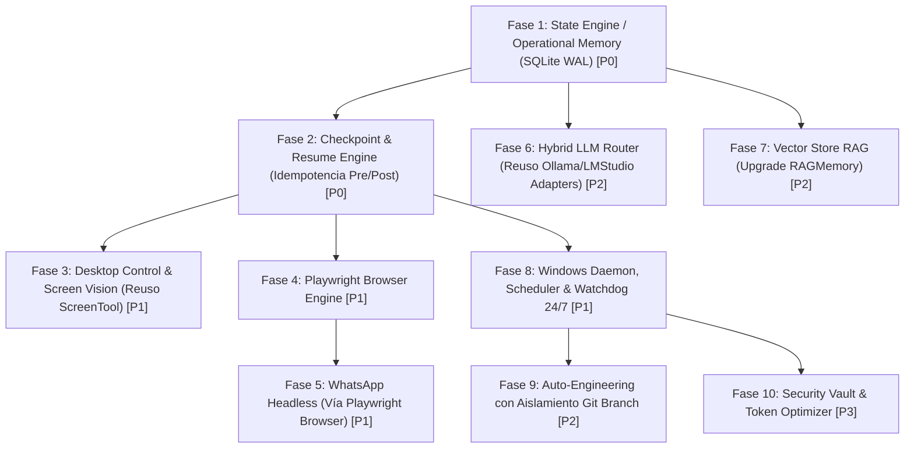

# AVATAR AI — IMPLEMENTATION PRECHECK (001)
## PRECHECK TÉCNICO DE ARQUITECTURA Y VALIDACIÓN DE COMPATIBILIDAD DEL ROADMAP

```text
DOCUMENT_ID: AVATAR_IMPLEMENTATION_PRECHECK_001
DATE: 2026-09-27
AUTHORITY: AUDITOR FORENSE DE ARQUITECTURA DE AVATAR AI
STATUS: COMPLETED
ROADMAP_STATUS: READY_WITH_CHANGES
CODE_MODIFIED: NO
FIRST_IMPLEMENTABLE_PHASE: FASE 1 (State Engine / Operational Memory)
PROJECT: Avatar (Sovereign Digital Assistant for Mauro)
```

---

## 1. RESUMEN EJECUTIVO

Se ha realizado la evaluación técnica y forense del plan de desarrollo propuesto en `AVATAR_IMPLEMENTATION_ROADMAP.md` frente a la arquitectura ejecutable actual de Avatar AI (`core/orchestrator.py`, `core/llm_provider.py`, `core/rag_memory.py`, `tools/`, `bridges/`, `tests/`).

### CONCLUSIÓN GENERAL
El roadmap propuesto es **conceptualmente correcto en su dirección**, pero **requiere ajustes arquitectónicos específicos antes de escribir código** para evitar:
1. **Duplicación de componentes existentes** (ej. adapters de Ollama/LM Studio ya existentes en `core/llm_provider.py` y `RAGMemory` en `core/rag_memory.py`).
2. **Peligros de seguridad en interrupción (`kill -9`)** si no se implementa checkpointing atómico pre/post ejecución de herramientas no idempotentes.
3. **Incompatibilidades de tecnología externa** (ej. la propuesta de `pywa` para WhatsApp requiere API de Meta Cloud, lo cual viola la soberanía local; debe reemplazarse por Playwright WhatsApp Web headless).
4. **Subestimación de requisitos para operación 24/7** (se requieren Watchdog, Dead-letter Queue, Heartbeat y Log Rotation adicionales).

---

## 2. EVALUACIÓN DETALLADA DE LAS 10 FASES DEL ROADMAP

---

### FASE 1: State Engine / Operational Memory
* **Clasificación:** `READY_WITH_CHANGES`
* **1. Compatibilidad:** 100% compatible con `core/orchestrator.py`.
* **2. Estructura de Archivos:** Encaja perfectamente como `core/state_db.py`.
* **3. Dependencias Declaradas:** Correctas (`sqlite3` nativo de Python en modo WAL).
* **4. Dependencias Faltantes:** Esquema de validación de modelos JSON para serialización.
* **5. Componente Existente:** `core/rag_memory.py` (`RAGMemory`) maneja actualmente `history.json` y `context.json`.
* **6. Riesgo de Duplicación:** ALTO si se crea un sistema separado. 
* **7. Riesgo de Rotura:** BAJO si se usa como capa de persistencia por debajo del orquestador.
* **8. Orden de Implementación:** CORRECTO (Es la base P0 obligatoria).
* **9/10. Verificación:** Suficiente si incluye prueba de integridad ante caída forzada.
* **11. Pruebas a Agregar:** Test unitario de simulación de fallo E/S durante escritura en SQLite WAL.
* **Estrategia de Reuso:** `EXISTING_COMPONENT: core/rag_memory.py` | `EXTENSION_REQUIRED: Refactorizar RAGMemory para usar backend SQLite state_db.py` | `REUSE_STRATEGY: Preservar la API pública de RAGMemory e integrar SQLite WAL`.

---

### FASE 2: Checkpoint Engine / Resume Engine
* **Clasificación:** `READY_WITH_CHANGES`
* **1. Compatibilidad:** Compatible con `ContinuousExecutionEngine` y `TaskQueue`.
* **2. Estructura de Archivos:** Encaja como `core/checkpoint_engine.py` y `core/resume_engine.py`.
* **3. Dependencias Declaradas:** Fase 1 (`State Engine`).
* **4. Dependencias Faltantes:** Marcador de idempotencia y estado `UNCERTAIN_EXECUTION` para herramientas no idempotentes.
* **5. Componente Existente:** `core/cognitive/continuous_loop.py` maneja la cola en memoria.
* **6. Riesgo de Duplicación:** BAJO.
* **7. Riesgo de Rotura:** ALTO si se re-ejecutan comandos destructivos tras un crash.
* **8. Orden de Implementación:** CORRECTO (P0 dependiente de Fase 1).
* **9/10. Verificación:** Requiere prueba de no-duplicación de comandos no idempotentes.
* **11. Pruebas a Agregar:** Test de interrupción en fase `TOOL_START` vs `TOOL_END`.

---

### FASE 3: Desktop Control / Vision / UI Automation
* **Clasificación:** `READY_WITH_CHANGES`
* **1. Compatibilidad:** Compatible con la suite de herramientas en `tools/`.
* **2. Estructura de Archivos:** Encaja como `tools/computer_control.py`.
* **3. Dependencias Declaradas:** `pywin32`, `pyautogui`, `pillow`.
* **4. Dependencias Faltantes:** OCR Engine local (EasyOCR o PyTesseract) y Windows UI Automation API.
* **5. Componente Existente:** `tools/screen_tool.py` (`ScreenTool`) ya existe para capturas de pantalla.
* **6. Riesgo de Duplicación:** ALTO si se reescribe la captura de pantalla.
* **7. Riesgo de Rotura:** BAJO.
* **8. Orden de Implementación:** CORRECTO (P1).
* **9/10. Verificación:** Suficiente.
* **11. Pruebas a Agregar:** Test de resolución de coordenadas con cambios de DPI de pantalla.
* **Estrategia de Reuso:** `EXISTING_COMPONENT: tools/screen_tool.py` | `EXTENSION_REQUIRED: Importar ScreenTool dentro de computer_control.py` | `REUSE_STRATEGY: No reescribir funciones de captura`.

---

### FASE 4: Playwright Browser Engine
* **Clasificación:** `READY_WITH_CHANGES`
* **1. Compatibilidad:** Compatible como herramienta nativa en `tools/`.
* **2. Estructura de Archivos:** Encaja como `tools/browser_controller.py`.
* **3. Dependencias Declaradas:** `playwright`.
* **4. Dependencias Faltantes:** Binarios de Chromium instalados (`playwright install chromium`).
* **5. Componente Existente:** `tools/web_tool.py` (`WEB_SEARCH`, `FETCH_URL`).
* **6. Riesgo de Duplicación:** MEDIO.
* **7. Riesgo de Rotura:** BAJO.
* **8. Orden de Implementación:** CORRECTO (P1).
* **9/10. Verificación:** Demuestra rendering JS y persistencia de cookies.
* **11. Pruebas a Agregar:** Test de navegación headless tras bloqueo de red o timeout.
* **Estrategia de Reuso:** `EXISTING_COMPONENT: tools/web_tool.py` | `EXTENSION_REQUIRED: Usar web_tool.py para sitios estáticos rápidos y Playwright para JS dinámico` | `REUSE_STRATEGY: Ruteo interno por complejidad de sitio`.

---

### FASE 5: WhatsApp Headless / Remote Control
* **Clasificación:** `REDESIGN_REQUIRED`
* **1. Compatibilidad:** Incompatible si se usa `pywa` (requiere Meta Cloud API y pago/registro corporativo).
* **2. Estructura de Archivos:** Encaja en `bridges/whatsapp_bridge.py`.
* **3. Dependencias Declaradas:** Inseguras en el proposal inicial.
* **4. Dependencias Faltantes:** Fase 4 (`Playwright Browser Engine`) y protocolo de autenticación de remitente.
* **5. Componente Existente:** `bridges/whatsapp_bridge.py` y `tools/whatsapp_auto_reply.py`.
* **6. Riesgo de Duplicación:** ALTO si se crea un nuevo puente.
* **7. Riesgo de Rotura:** ALTO si roba el foco de la pantalla.
* **8. Orden de Implementación:** Requiere Fase 4 previa.
* **9/10. Verificación:** Debe certificar operación con pantalla de Windows bloqueada.
* **11. Pruebas a Agregar:** Test de simulación de comandos remotos no autorizados (inmunidad).
* **REDESIGN REQUIRED:** Reemplazar propuesta de `pywa` por cliente WhatsApp Web Headless usando Playwright de la Fase 4.

---

### FASE 6: Ollama / LM Studio / Hybrid Router
* **Clasificación:** `READY_WITH_CHANGES`
* **1. Compatibilidad:** 100% compatible.
* **2. Estructura de Archivos:** `core/llm_provider.py` YA CONTIENE las clases `OllamaAdapter` y `LMStudioAdapter`.
* **3. Dependencias Declaradas:** Enrutador de modelos.
* **4. Dependencias Faltantes:** Polling de salud en segundo plano para endpoints locales.
* **5. Componente Existente:** `core/llm_provider.py` (Líneas 285-440).
* **6. Riesgo de Duplicación:** EXTREMO si se crean nuevos archivos `providers/ollama_provider.py`.
* **7. Riesgo de Rotura:** BAJO.
* **8. Orden de Implementación:** CORRECTO (P2).
* **9/10. Verificación:** Demuestra conmutación transparente ante caída de red.
* **11. Pruebas a Agregar:** Test de failover síncrono Gemini -> Ollama -> LM Studio.
* **Estrategia de Reuso:** `EXISTING_COMPONENT: core/llm_provider.py (OllamaAdapter, LMStudioAdapter)` | `EXTENSION_REQUIRED: Agregar clase LLMRouter en llm_provider.py` | `REUSE_STRATEGY: NO CREAR NUEVOS ARCHIVOS DE PROVEEDORES; extender la arquitectura multi-provider existente`.

---

### FASE 7: Vector Store / RAG
* **Clasificación:** `READY_WITH_CHANGES`
* **1. Compatibilidad:** Compatible.
* **2. Estructura de Archivos:** Debe integrarse en `core/rag_memory.py`.
* **3. Dependencias Declaradas:** `chromadb` o `faiss-cpu`, `sentence-transformers`.
* **4. Dependencias Faltantes:** Modelo de embeddings liviano local (`all-MiniLM-L6-v2`).
* **5. Componente Existente:** `core/rag_memory.py` (`RAGMemory`).
* **6. Riesgo de Duplicación:** ALTO si se crea `tools/rag_engine.py`.
* **7. Riesgo de Rotura:** BAJO.
* **8. Orden de Implementación:** CORRECTO (P2).
* **9/10. Verificación:** Suficiente.
* **11. Pruebas a Agregar:** Test de tiempo de respuesta de query vectorial con 10,000 chunks indexados.
* **Estrategia de Reuso:** `EXISTING_COMPONENT: core/rag_memory.py` | `EXTENSION_REQUIRED: Reemplazar búsqueda lexical TF-IDF por ChromaDB persistente en disco` | `REUSE_STRATEGY: Mantener interfaz pública RAGMemory`.

---

### FASE 8: Windows Daemon / Scheduler
* **Clasificación:** `DEPENDENCY_MISSING`
* **1. Compatibilidad:** Compatible.
* **2. Estructura de Archivos:** Encaja en `service/windows_daemon.py` y `core/scheduler.py`.
* **3. Dependencias Declaradas:** `APScheduler`, `pywin32`.
* **4. Dependencias Faltantes:** Watchdog Supervisor Process, Dead-letter Queue, Heartbeat Monitor.
* **5. Componente Existente:** Ninguno completo.
* **6. Riesgo de Duplicación:** BAJO.
* **7. Riesgo de Rotura:** MEDIO si hay fugas de memoria.
* **8. Orden de Implementación:** Requiere Fases 1 y 2 terminadas.
* **9/10. Verificación:** Demuestra inicio al boot y ejecución tras reinicio de Windows.
* **11. Pruebas a Agregar:** Test de recuperación ante crash del proceso hijo controlado por Watchdog.

---

### FASE 9: Safe Sandbox / Module Reloader / Auto-engineering
* **Clasificación:** `REDESIGN_REQUIRED`
* **1. Compatibilidad:** Incompatible si se aplica directamente sobre la rama principal sin aislamiento Git.
* **2. Estructura de Archivos:** Encaja en `core/safe_sandbox.py` y `core/module_reloader.py`.
* **3. Dependencias Declaradas:** `pytest`, `AST`.
* **4. Dependencias Faltantes:** Git Worktree / Git Branch Isolation, Rollback Manager.
* **5. Componente Existente:** `core/cognitive/verifier.py`, `tests/test_self_development.py`.
* **6. Riesgo de Duplicación:** BAJO.
* **7. Riesgo de Rotura:** EXTREMO (Auto-corrupción del sistema).
* **8. Orden de Implementación:** CORRECTO (P2).
* **9/10. Verificación:** Insuficiente en la versión previa del roadmap.
* **11. Pruebas a Agregar:** Test de inyección de código malicioso/sintácticamente inválido y verificación de rollback 100% limpio.
* **REDESIGN REQUIRED:** Es obligatorio exigir aislamiento por rama de Git (`git checkout -b auto-edit-XXX`) y validación AST completa antes de intentar cualquier hot-reloading en caliente.

---

### FASE 10: Security Vault / Token Optimization
* **Clasificación:** `READY_WITH_CHANGES`
* **1. Compatibilidad:** Compatible.
* **2. Estructura de Archivos:** Encaja en `core/security_vault.py`.
* **3. Dependencias Declaradas:** `cryptography`.
* **4. Dependencias Faltantes:** `keyring` (Windows Credential Manager / DPAPI).
* **5. Componente Existente:** `config.json` loader.
* **6. Riesgo de Duplicación:** BAJO.
* **7. Riesgo de Rotura:** BAJO.
* **8. Orden de Implementation:** CORRECTO (P3).
* **9/10. Verificación:** Suficiente.
* **11. Pruebas a Agregar:** Test de eliminación de credenciales de los logs de consola y archivos Markdown.

---

## 3. VALIDACIONES ESPECIALES Y REQUISITOS TÉCNICOS

### 3.1. Contrato Conceptual de Persistencia (`State Engine DB`)
Se aprueba **SQLite WAL** como motor de persistencia.

* **DATOS OBLIGATORIOS A PERSISTIR:**
  - `sessions` (`session_id`, `started_at`, `status`).
  - `missions` (`mission_id`, `raw_prompt`, `classified_intent`, `status`).
  - `planner_state` (`task_id`, `step_index`, `tool_name`, `tool_args`, `status`: `PENDING`/`IN_PROGRESS`/`COMPLETED`/`FAILED`/`VERIFIED`).
  - `verification_records` (`fact_id`, `claim`, `verified_status`, `evidence_data`).
  - `recovery_state` (`retry_count`, `failure_context`, `hypotheses_history`).

* **DATOS EXCLUIDOS DE LA BASE DE DATOS:**
  - Capturas de pantalla en formato binario (almacenar en `scratch/` y guardar solo la ruta URI).
  - Objetos en memoria transitorios de Python (sockets, instancias PyQt GUI).

---

### 3.2. Seguridad de Checkpoint y Caída (`kill -9 -> restart -> resume`)
El flujo `kill -9` propuesto es seguro **ÚNICAMENTE SI SE IMPLEMENTA CHECKPOINTING EN DOS TIEMPOS**:
1. **Checkpoint `PRE_TOOL_EXECUTION` (`STEP_IN_PROGRESS`)**: Se guarda antes de invocar la herramienta.
2. **Checkpoint `POST_TOOL_EXECUTION` (`STEP_COMPLETED`)**: Se guarda tras confirmar la ejecución y verificación.

* **Regla de Resumabilidad:** Si la aplicación reinicia y encuentra un estado `STEP_IN_PROGRESS` en una herramienta **no idempotente** (ej. comando bash destructivo o envío de mensaje), el `ResumeEngine` **NO RE-EJECUTA LA HERRAMIENTA AUTOMÁTICAMENTE**. En su lugar, marca el paso como `UNCERTAIN_EXECUTION` y delega a `PhysicalFactVerifier` para comprobar si el efecto ya ocurrió en el sistema.

---

### 3.3. Requisitos Faltantes para Operación 24/7 Real
`State Engine` + `Checkpoints` + `Resume` + `Scheduler` + `Windows Service` son **INSUFICIENTES** para garantizar 24/7 sin caídas. Se incorporan los siguientes 8 componentes obligatorios a la arquitectura:

1. **Watchdog Supervisor Process:** Proceso ligero guardián que reinicia a Avatar si la aplicación se congela.
2. **Health Monitor & Heartbeat:** Ping interno cada 30 segundos.
3. **Dead-Letter Task Queue:** Aísla tareas tóxicas que provocan crashes repetidos para evitar bucles infinitos de reinicio.
4. **Graceful Shutdown Handler:** Captura de señales SIGINT/SIGTERM para escribir checkpoints limpios antes de cerrar.
5. **Resource Limiter & Memory Leak Prevention:** Forzar `gc.collect()` e inspeccionar consumo RSS.
6. **Structured Logging & Log Rotation:** Rotación de archivos de logs para evitar saturación de disco.
7. **Provider Recovery:** Fallback automático a Ollama local ante caídas de internet.
8. **Queue State Persistence:** Persistencia de la cola de tareas pendientes en SQLite.

---

### 3.4. Requisitos de Seguridad para Auto-Ingeniería (Fase 9)
Para evitar que Avatar corrompa su propio código fuente durante la auto-mejora, se establecen las siguientes barreras arquitectónicas:

1. **Git Branch Isolation:** Toda modificación de código se realiza en una rama aislada (`git checkout -b auto-edit-TIMESTAMP`).
2. **AST Syntax Validation:** Validación previa con `ast.parse()` antes de guardar.
3. **Test Suite Verification:** Ejecución de `pytest` en la rama temporal.
4. **Automatic Rollback:** `git reset --hard` y descarte de la rama si falla alguna prueba.
5. **Security Boundary:** Prohibición absoluta de modificar `verifier.py`, `security_vault.py` o `safe_sandbox.py` sin confirmación explícita de Mauro.

---

## 4. ORDEN DEFINITIVO Y ROADMAP CORREGIDO



### Clasificación Final del Orden de Ejecución:

1. **PRIMERA FASE IMPLEMENTABLE:** **Fase 1 (State Engine / Operational Memory)**.
2. **FASES PARALELIZABLES:**
   - **Fase 3** y **Fase 4** (tras completar Fase 2).
   - **Fase 6** y **Fase 7** (tras completar Fase 1).
3. **FASES REDISEÑADAS (REQUERIDAS ANTES DE CÓDIGO):**
   - **Fase 5 (WhatsApp Headless):** Rediseñada para usar Playwright en lugar de API Meta Cloud.
   - **Fase 6 (Hybrid Router):** Rediseñada para reutilizar adaptadores existentes en `core/llm_provider.py`.
   - **Fase 7 (Vector RAG):** Rediseñada para extender `core/rag_memory.py`.
   - **Fase 9 (Auto-Engineering):** Rediseñada para exigir aislamiento de ramas Git y rollback automático.
