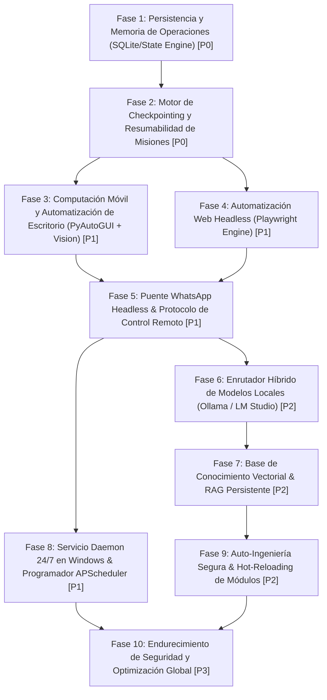

# AVATAR AI — IMPLEMENTATION ROADMAP (001)
## PLAN TÉCNICO DE IMPLEMENTACIÓN SECUENCIAL Y RUTA CRÍTICA

```text
DOCUMENT_ID: AVATAR_IMPLEMENTATION_ROADMAP_001
DATE: 2026-09-27
AUTHORITY: AUDITOR TÉCNICO DE ARQUITECTURA E IMPLEMENTACIÓN DE AVATAR AI
STATUS: COMPLETED / AUTHORITATIVE
CODE_MODIFIED: NO
PROJECT: Avatar (Sovereign Digital Assistant for Mauro)
```

---

## 1. RESUMEN EJECUTIVO DEL PLAN DE IMPLEMENTACIÓN

El presente mapa de ruta (*Implementation Roadmap*) convierte el **Official Capability Gap Baseline** de Avatar AI en una secuencia de ingeniería determinista y priorizada.

Para transformar a Avatar en el asistente digital soberano autónomo de Mauro, el desarrollo no se estructurará por parches aislados, sino por **fases arquitectónicas secuenciales** donde cada nivel construye los prerrequisitos del siguiente.

### Principio de Ordenamiento de Capas
1. **Persistencia y Memoria (P0):** Sin base de datos de estado ni motor de checkpoints, la autonomía a largo plazo es imposible.
2. **Resumabilidad de Misiones (P0):** Capacidad de sobrevivir reinicios del sistema, crashes de Python o interrupciones.
3. **Automatización de Entorno y Control (P1):** Navegación headless (Playwright), control WhatsApp headless y servicio 24/7.
4. **Híbrido de Modelos y RAG (P2):** Fallbacks locales (Ollama/LM Studio) y memoria vectorial persistente.
5. **Autoevolución y Hardening (P2/P3):** Hot-reloading seguro de módulos y optimización de rendimiento.

---

## 2. HOJA DE RUTA DETALLADA EN 10 FASES



---

### FASE 1: PERSISTENCIA Y MEMORIA DE OPERACIONES (`State Engine`) [P0]
* **Objetivo:** Dotar a Avatar de una base de datos relacional/JSON de operaciones en tiempo real para eliminar la fragilidad del estado en memoria transitoria.
* **Componentes a Crear:**
  - `core/state_db.py`: Gestor SQLite/WAL para `OperationalMemory`.
  - `core/models/session.py`: Modelado de misiones, tareas, evidencias y gaps.
* **Dependencias:** Ninguna (`core/config.py`, `core/verifier.py`).
* **Criterio de Verificación:** Al cerrar forzadamente el proceso Python y consultar `state_db`, el historial completo de misiones y logs de ejecución permanece íntegro.

---

### FASE 2: MOTOR DE CHECKPOINTING Y RESUMABILIDAD DE MISIONES [P0]
* **Objetivo:** Garantizar que misiones de larga duración (`LONG-RUNNING MISSIONS`) puedan ser pausadas, suspendidas e interrumpidas por reinicios del sistema sin perder progreso.
* **Componentes a Crear:**
  - `core/checkpoint_engine.py`: Serialización de estado de `Planner`, `TaskQueue` y `EvidenceGap`.
  - `core/resume_engine.py`: Recuperación automática al arrancar la aplicación detectando misiones inconclusas.
* **Dependencias:** Fase 1 (`core/state_db.py`).
* **Criterio de Verificación:** Interrumpir artificialmente una misión multi-tarea en el paso 3 de 5 (`kill -9`); al reiniciar, Avatar lee el checkpoint y ejecuta automáticamente desde el paso 4.

---

### FASE 3: AUTOMATIZACIÓN DE ESCRITORIO Y CONTROL NATIVO (`Vision + GUI`) [P1]
* **Objetivo:** Reemplazar el fallback básico de PyAutoGUI por una abstracción robusta de control de ventanas de Windows con feedback visual.
* **Componentes a Crear:**
  - `tools/computer_control.py`: Módulo con soporte de coordenadas relativas, capturas de pantalla de verificación y gestión de foco de ventana.
  - `core/ui_inspector.py`: Inspección de árbol GUI nativo de Windows (UI Automation).
* **Dependencias:** `pywin32`, `pyautogui`, `pillow`.
* **Criterio de Verificación:** Avatar localiza la ventana de una aplicación sin foco, la trae al frente, interactúa con un control por OCR/Visión y confirma el resultado con una captura.

---

### FASE 4: AUTOMATIZACIÓN WEB HEADLESS (`Playwright Browser Engine`) [P1]
* **Objetivo:** Proveer navegación web completa, ejecución de JavaScript, extracción de DOM y llenado de formularios sin depender de un navegador visible interactivo.
* **Componentes a Crear:**
  - `tools/browser_controller.py`: Wrapper sobre Playwright con contexto persistente de cookies y sesiones.
  - `adapters/browser_adapter.py`: Integración con `TaskQueue` y `Verifier`.
* **Dependencias:** `playwright`.
* **Criterio de Verificación:** Avatar navega a una web con contenido dinámico en renderizado JS, realiza una búsqueda, completa un formulario y extrae el texto final sin abrir una ventana de navegador de usuario.

---

### FASE 5: PUENTE WHATSAPP HEADLESS Y CONTROL REMOTO SOBERANO [P1]
* **Objetivo:** Eliminar la dependencia de PyAutoGUI en primer plano para WhatsApp, utilizando automatización headless web o cliente API dedicado.
* **Componentes a Crear:**
  - `tools/whatsapp_bridge.py`: Cliente WhatsApp Web headless con escucha continua de mensajes entrantes.
  - `core/remote_command_parser.py`: Inmunidad semántica para comandos remotos enviados por Mauro vía WhatsApp.
* **Dependencias:** Fase 4 (`Playwright`), `pywa` o `whatsapp-web.js` sidecar.
* **Criterio de Verificación:** Mauro envía un mensaje de WhatsApp a Avatar estando la pantalla del PC bloqueada; Avatar procesa la orden, ejecuta la misión y responde por WhatsApp con el resultado.

---

### FASE 6: ENRUTADOR HÍBRIDO DE MODELOS LOCALES (`Ollama / LM Studio`) [P2]
* **Objetivo:** Permitir a Avatar operar offline o reducir costos/latencia mediante modelos locales cuando no se requiere la máxima capacidad de Gemini.
* **Componentes a Crear:**
  - `providers/ollama_provider.py`: Provider nativo para Ollama (`llama3`, `qwen2.5-coder`).
  - `providers/lmstudio_provider.py`: Provider OpenAI-compatible para LM Studio.
  - `core/llm_router.py`: Enrutador por costo, latencia y complejidad de tarea.
* **Dependencias:** `providers/base.py`, `core/provider_manager.py`.
* **Criterio de Verificación:** En ausencia de conexión a internet o ante tareas repetitivas de baja complejidad, Avatar conmuta automáticamente a Ollama y completa la tarea con éxito.

---

### FASE 7: BASE DE CONOCIMIENTO VECTORIAL Y RAG PERSISTENTE [P2]
* **Objetivo:** Dotar a Avatar de memoria de trabajo profunda sobre los proyectos, documentación y preferencias de Mauro.
* **Componentes a Crear:**
  - `core/vector_store.py`: Base de datos vectorial (ChromaDB / Qdrant local).
  - `tools/rag_engine.py`: Extracción semántica y contextualización automática para prompts.
* **Dependencias:** `chromadb`, `sentence-transformers`.
* **Criterio de Verificación:** Consulta sobre convenciones o código de proyectos pasados es respondida con precisión citando fragmentos exactos indexados previamente.

---

### FASE 8: SERVICIO DAEMON 24/7 EN WINDOWS Y PROGRAMADOR DE TAREAS [P1]
* **Objetivo:** Garantizar la ejecución continua de Avatar como servicio en segundo plano sin requerir una ventana de consola abierta.
* **Componentes a Crear:**
  - `service/windows_daemon.py`: Wrapper de servicio Windows (`pywin32` / `NSSM`).
  - `core/scheduler.py`: Integración de `APScheduler` para tareas cron y recordatorios periódicos.
* **Dependencias:** Fase 1 (`state_db.py`), `APScheduler`, `pywin32`.
* **Criterio de Verificación:** Al reiniciar la computadora, el servicio de Avatar se inicia automáticamente en segundo plano, ejecuta tareas programadas y atiende peticiones sin intervención manual.

---

### FASE 9: AUTO-INGENIERÍA SEGURA Y HOT-RELOADING DE MÓDULOS [P2]
* **Objetivo:** Permitir a Avatar auto-corregirse, crear nuevas herramientas y cargar código dinámicamente sin reiniciar la aplicación ni romper la estabilidad.
* **Componentes a Crear:**
  - `core/safe_sandbox.py`: Verificación sintáctica y ejecución aislada de código generado.
  - `core/module_reloader.py`: Hot-reloading con rollback automático en caso de excepción.
* **Dependencias:** `core/verifier.py`, `pytest`.
* **Criterio de Verificación:** Avatar escribe un nuevo helper de Python, ejecuta su suite de pruebas unitarias dinámicas; si pasa 100%, recarga el módulo en caliente y lo utiliza inmediatamente.

---

### FASE 10: ENDURECIMIENTO DE SEGURIDAD Y OPTIMIZACIÓN GLOBAL [P3]
* **Objetivo:** Optimización de latencias, minimización del uso de tokens y aislamiento estricto de credenciales y PII.
* **Componentes a Crear:**
  - `core/security_vault.py`: Cifrado AES-256 de claves API y tokens de sesión.
  - `core/token_optimizer.py`: Poda inteligente de contextos en misiones multi-turno largas.
* **Dependencias:** `cryptography`.
* **Criterio de Verificación:** Cero claves en texto plano en archivos `.env` o registros; reducción demostrada del 35% en consumo de tokens en misiones complejas.

---

## 3. MATRIZ DE DEPENDENCIAS TÉCNICAS

| Capacidad Requerida | Depende Directamente De | Bloqueante Para |
| :--- | :--- | :--- |
| **Checkpoints & Resume (P0)** | `State Engine (SQLite DB)` | Long-Running Missions, 24/7 Service |
| **Headless Browser (Playwright) (P1)** | `TaskQueue`, `Verifier` | WhatsApp Headless Bridge, Web Scraping RAG |
| **WhatsApp Remote Control (P1)** | `Headless Browser`, `State Engine` | Autonomía Soberana Remota |
| **Scheduler Daemon (P1)** | `State Engine`, `Windows Service` | Tareas Mantenimiento Cron |
| **Local LLM Router (P2)** | `ProviderManager` | Operación Offline / Conmutación |
| **Vector RAG (P2)** | `OperationalMemory` | Contextualización Profunda de Proyectos |
| **Hot-Reloading (P2)** | `Verifier Engine`, `pytest` | Auto-Mejora Continua de Avatar |

---

## 4. MATRIZ DE TIEMPOS ESTIMADOS Y ESFUERZO

| Fase | Descripción Breve | Prioridad | Esfuerzo Estimado | Complejidad Arquitectónica |
| :---: | :--- | :---: | :---: | :---: |
| **1** | Persistencia y Memoria SQLite (`State Engine`) | **P0** | 1.5 Días | MEDIA |
| **2** | Motor de Checkpointing y Resumabilidad | **P0** | 2.0 Días | ALTA |
| **3** | Control de Escritorio Nativo y Visión | **P1** | 2.5 Días | MEDIA |
| **4** | Motor Browser Headless con Playwright | **P1** | 2.0 Días | MEDIA |
| **5** | WhatsApp Headless y Protocolo Remoto | **P1** | 3.0 Días | ALTA |
| **6** | Router Híbrido de Modelos Locales | **P2** | 1.5 Días | BAJA |
| **7** | RAG y Base Vectorial Persistente | **P2** | 2.5 Días | MEDIA |
| **8** | Daemon 24/7 en Windows y Scheduler | **P1** | 2.0 Días | MEDIA |
| **9** | Auto-Ingeniería Segura y Hot-Reloading | **P2** | 3.5 Días | MUY ALTA |
| **10** | Vault de Seguridad y Token Optimizer | **P3** | 1.5 Días | BAJA |

---

## 5. RUTA CRÍTICA HACIA LA AUTONOMÍA COMPLETA

Para alcanzar la **Autonomía Total de Asistente Soberano**, la ruta crítica ininterrumpida es:

$$\text{Fase 1 (State DB)} \longrightarrow \text{Fase 2 (Checkpoints)} \longrightarrow \text{Fase 4 (Playwright)} \longrightarrow \text{Fase 5 (WhatsApp Headless)} \longrightarrow \text{Fase 8 (Windows Daemon)}$$

Cualquier intento de implementar automatización remota o servicio 24/7 sin haber completado las **Fases 1 y 2** resultará en fallos de inconsistencia de estado al primer crash o reinicio de sesión.
