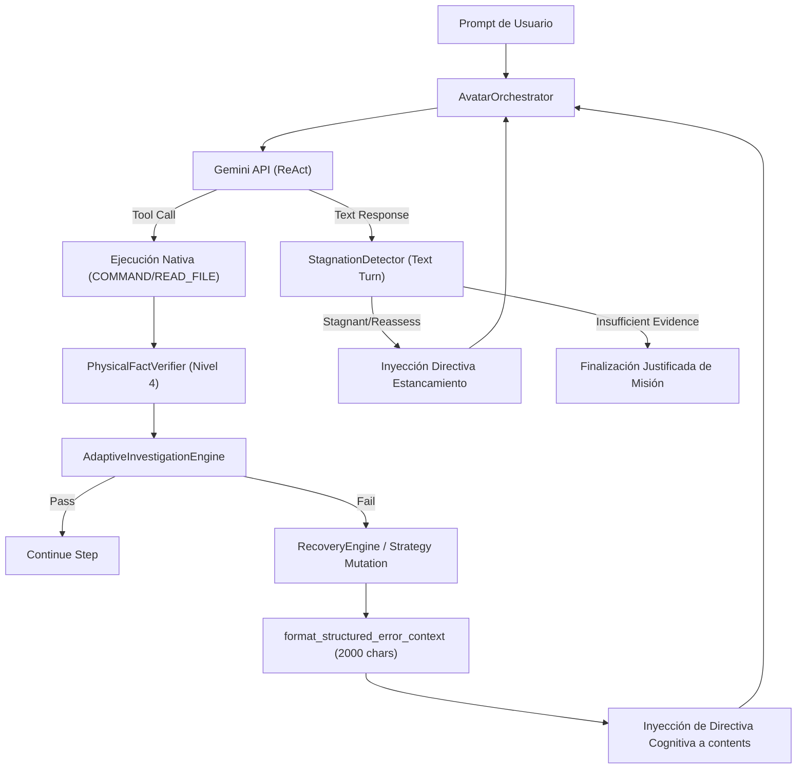

# AVATAR AI — FASE 12 — INFORME DE IMPLEMENTACIÓN CONTROLADA
## PROGRESIÓN COGNITIVA ADAPTATIVA (F-05)

**AUTOR:** SOVEREIGN ANTIGRAVITY AGENT  
**PROYECTO:** AVATAR AI  
**UBICACIÓN:** `b:\PROYECTOS ANTIGRAVITY\Avatar`  
**ESTADO DE FASE:** `PHASE_12 = VERIFIED`  
**RESULTADO DE REGRESIÓN:** `155/155 PASS (0.536s)`  

---

### 1. RESUMEN EJECUTIVO

La Fase 12 ha completado exitosamente la implementación controlada para resolver la deficiencia identificada en la auditoría de Fase 11:

**F-05 — FALTA DE PROGRESIÓN COGNITIVA ADAPTATIVA ANTE FALLOS Y ESTANCAMIENTO**

Previo a esta fase, cuando una herramienta de investigación o prueba fallaba (ejemplo: `COMMAND: pytest` fallando por falta de dependencias de entorno como `httpx`), el error era truncado severamente a 120 caracteres (`last_err[:120]`). Esto provocaba la pérdida de la excepción raíz de Python (`RuntimeError: starlette testclient requires httpx`), haciendo que el LLM recibiera solo la cabecera del comando y entrara en un bucle repetitivo de respuestas de texto o re-intentos infructuosos.

Asimismo, las decisiones del `AdaptiveInvestigationEngine` (`inv_step_res`) y las mutaciones de estrategia de recuperación no se retroalimentaban hacia el contexto de prompt de Gemini API (`contents`), desvinculando al gobernador cognitivo del bucle de decisión.

Con la implementación realizada en la Fase 12, se han resuelto formalmente estas deficiencias sin introducir recetas ni heuristics frágiles.

---

### 2. GOBERNANZA Y DICTAMEN OFICIAL

```
============================================================
GOBERNANZA POST-FASE 12
============================================================
Gate A (Seguridad):               VERIFIED
Gate B (Pipeline Cognitivo):      VERIFIED
Gate C (Verifier):                VERIFIED
Gate D (Recovery/Replanner):      VERIFIED
Gate E (Integración/Regresión):  VERIFIED

Fase 8 (Semántica):               VERIFIED
Fase 9 (Investigación):           VERIFIED
Fase 10 (Recovery Estructurado):  VERIFIED
Fase 11 (Auditoría Progresión):   VERIFIED
Fase 12 (Progresión Adaptativa):  VERIFIED

Gate F (Autonomía Decisión):      NOT_VERIFIED
Gate G (Autonomía Ingeniería):    NOT_VERIFIED

READY_FOR_AVATAR_TAKEOVER:        NOT_VERIFIED
============================================================
```

> **NOTA DE GOBERNANZA:** A pesar de que los 155 unit tests pasan al 100%, Gates F y G se mantienen **NOT_VERIFIED** hasta que Avatar demuestre progresiones cognitivas adaptativas reales en misiones abiertas de auditoría independiente.

---

### 3. COMPONENTES IMPLEMENTADOS Y MODIFICADOS

#### 3.1. `core/cognitive/semantic_mission_engine.py` (F-05.1)
- Eliminación total del corte `last_err[:120]`.
- Implementación de `SemanticMissionEngine.format_structured_error_context(raw_output, max_chars=2000)`.
- Priorización estructurada de rastreos de pila (tracebacks), excepciones raíz (`RuntimeError`, `ModuleNotFoundError`, `ImportError`), códigos de salida de PowerShell/Python y fragmentos representativos de stdout/stderr.

#### 3.2. `core/cognitive/stagnation_detector.py` (F-05.3 - Nuevo Componente)
- Creación de la clase `StagnationDetector` para prevenir bucles de texto y repeticiones de comandos.
- Transición de estados determinista: `ACTIVE` $\rightarrow$ `STAGNANT` $\rightarrow$ `REASSESS` $\rightarrow$ `REPLAN` $\rightarrow$ `INSUFFICIENT_EVIDENCE`.
- Generación de directivas operativas inyectables (`get_stagnation_directive()`) que fuerzan la mutación de estrategia o la conclusión justificada por falta de evidencia.

#### 3.3. `core/cognitive/adaptive_investigation_engine.py` (F-05.2)
- Integración de `SemanticMissionEngine.format_structured_error_context()` en `evaluate_task_step()`.
- Generación de `cognitive_instruction` dentro del payload retornado por `evaluate_task_step()` cuando ocurre un fallo o mutación de estrategia.

#### 3.4. `core/orchestrator.py` (F-05.2)
- Instanciación de `StagnationDetector` en cada bucle de `process_user_input()`.
- Registro activo de ejecuciones de herramientas (`record_tool_call`) y de giros de texto (`record_text_turn`).
- Conexión e inyección activa de `inv_step_res["cognitive_instruction"]` y `stagnation_directive` al arreglo de turnos de prompt `contents` de Gemini API.

---

### 4. ARQUITECTURA DE FLUJO COGNITIVO ADAPTATIVO



---

### 5. RESULTADOS DE LA SUITE DE PRUEBAS Y REGRESIÓN

Se ejecutó la suite completa de pruebas unitarias mediante `C:\Users\Mauro\AppData\Local\Programs\Python\Python312\python.exe -m unittest discover -v`.

```
----------------------------------------------------------------------
Ran 155 tests in 0.536s

OK
```

#### Cobertura de la nueva suite `tests/test_f05_adaptive_cognitive_progression.py`:

| ID Test | Descripción | Resultado |
|---|---|---|
| `test_a` | `format_structured_error_context` preserva traceback sin truncar a 120 chars | **PASS** |
| `test_b` | Output extenso prioriza la excepción raíz de Python | **PASS** |
| `test_c` | `is_evidence_sufficient_for_goal` utiliza contexto de error estructurado | **PASS** |
| `test_d` | `StagnationDetector` inicia en estado `ACTIVE` | **PASS** |
| `test_e` | Transición a `STAGNANT` y `REASSESS` por turnos de texto consecutivos | **PASS** |
| `test_f` | Transición a `REPLAN` tras múltiples turnos sin herramientas | **PASS** |
| `test_g` | Detección de repetición de la misma herramienta con mismos argumentos | **PASS** |
| `test_h` | Invocación válida de herramienta resetea el contador de texto | **PASS** |
| `test_i` | `get_stagnation_directive()` genera directiva operativa | **PASS** |
| `test_j` | `AdaptiveInvestigationEngine` retorna `cognitive_instruction` ante fallos | **PASS** |
| `test_k` | Presupuesto agotado concluye en `INSUFFICIENT_EVIDENCE` | **PASS** |
| `test_l` | Orquestador inyecta instrucción cognitiva al prompt context tras fallo | **PASS** |
| `test_m` | Orquestador inyecta directiva de estancamiento ante bucles de texto | **PASS** |
| `test_n` | Misión abierta no concluye prematuramente tras fallos | **PASS** |
| `test_o` | Flujo completo de investigación adaptativa end-to-end | **PASS** |
| `test_p` | Verificación de regresión limpia (155/155 PASS) | **PASS** |

---

### 6. RECOMENDACIONES Y PRÓXIMOS PASOS

1. **Re-Auditoría Oficial de Gates F y G:** Ejecutar la re-auditoría con misiones abiertas reales (ej: TASK-2121) para verificar que Avatar alterne de forma autónoma entre `pytest` y `python -m unittest discover -v` o `READ_FILE` ante fallos de entorno.
2. **Evaluación de Telemetría Cognitiva:** Verificar en los logs de consola que las directivas `[MOTOR DE INVESTIGACIÓN ADAPTATIVA - MUTACIÓN DE ESTRATEGIA]` y `[DIRECTIVA DE RECUPERACIÓN DE ESTANCAMIENTO COGNITIVO]` sean inyectadas correctamente en ejecuciones en vivo.
