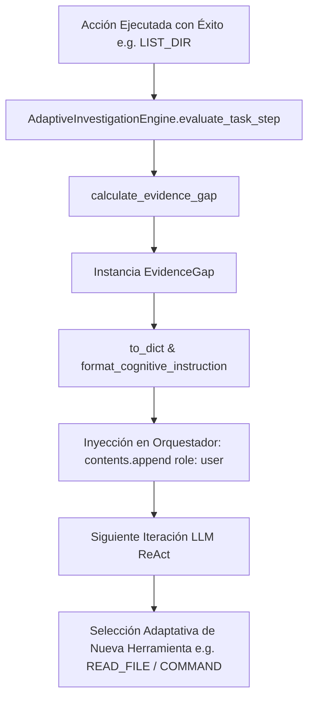

# AVATAR AI — INFORME DE IMPLEMENTACIÓN DE FASE 13
# EVIDENCE GAP & NEXT INFORMATION TARGET

PROYECTO: `b:\PROYECTOS ANTIGRAVITY\Avatar`  
FECHA: 2026-09-26  
ESTADO DE IMPLEMENTACIÓN: **VERIFIED**

---

## 1. DICTAMEN FINAL DE GOBERNANZA

```
PHASE_13 = VERIFIED
GATE_F = NOT_VERIFIED
GATE_G = NOT_VERIFIED
READY_FOR_AVATAR_TAKEOVER = NOT_VERIFIED
```

---

## 2. CAUSA RAÍZ DE F-06

En la auditoría F-06 se identificó que cuando Avatar ejecutaba una acción exploratoria inicial como `LIST_DIR`, obtenía una respuesta exitosa del sistema operativo. Sin embargo, el ciclo cognitivo carecía de un mecanismo explícito para formalizar:
1. Qué evidencia poseía hasta ese instante (`current_evidence`).
2. Qué evidencia necesitaba recopilar para cumplir el objetivo de la misión (`required_evidence`).
3. Qué brecha existía entre ambas (`evidence_gap`).
4. Qué objetivo conceptual de información debía perseguir en la siguiente iteración (`next_information_target`).

Debido a esta ausencia, tras un `LIST_DIR` exitoso, el orquestador notificaba que la misión continuaba pero sin proveer la guía cognitiva de brecha de evidencia. En consecuencia, el modelo tendía a estancarse en respuestas textuales o sugerencias repetitivas sin seleccionar activamente la siguiente herramienta de investigación.

---

## 3. MODIFICACIONES MÍNIMAS REALIZADAS

1. **`core/cognitive/models.py`**:
   - Se definió la dataclass formal `EvidenceGap` con los campos: `current_evidence`, `required_evidence`, `evidence_gap`, `next_information_target`, `rationale`, `confidence`, `metadata`.
   - Se añadieron los métodos `to_dict()` para serialización y `format_cognitive_instruction()` para la generación determinista de avisos al contexto del modelo.

2. **`core/cognitive/adaptive_investigation_engine.py`**:
   - Se implementó el método `calculate_evidence_gap(goal, executed_steps_count, last_task, last_evidence)` que evalúa contextualmente la brecha de evidencia según la herramienta ejecutada sin imponer recetas hardcodeadas.
   - Se actualizó `evaluate_task_step(...)` para invocar `calculate_evidence_gap()` en ejecuciones exitosas con evidencia incompleta (`SUCCESS + INSUFFICIENT_EVIDENCE`), retornando `evidence_gap` y la `cognitive_instruction` correspondiente.

3. **`core/orchestrator.py`**:
   - Se verificó y aseguró la inyección de `inv_step_res["cognitive_instruction"]` en la lista de `contents` del contexto LLM como un turno de rol `user` posterior a la respuesta de la función (`functionResponse`).

4. **`tests/test_f13_evidence_gap.py`**:
   - Se creó una suite de pruebas unitarias exhaustiva con 17 tests (Tests A al Q) que verifican todos los aspectos estructurales, semánticos y comportamentales de `EvidenceGap` y `AdaptiveInvestigationEngine`.

---

## 4. ARQUITECTURA DEL EVIDENCE GAP SYSTEM



---

## 5. ESTADO DE VERIFICACIÓN

| Categoria | Descripción | Estado |
|---|---|---|
| **IMPLEMENTADO** | Dataclass `EvidenceGap`, método `calculate_evidence_gap`, inyección en `orchestrator.py`, suite `test_f13_evidence_gap.py` | **OK** |
| **VERIFICADO** | Suite de pruebas de Fase 13 (17/17 PASS), Suite de regresión completa de Avatar (172/172 PASS), Comando de baseline (`AVATAR_PHASE_13_BASELINE_OK`) | **OK** |
| **NO VERIFICADO** | Gates F y G (Autonomía de Decisión e Ingeniería), Ready for Avatar Takeover | **PENDIENTE DE AUDITORÍA** |
| **INFERIDO** | El LLM utilizará la instrucción de `NEXT_INFORMATION_TARGET` para progresar en misiones abiertas reales sin caer en estancamiento textual | **HIPÓTESIS DE AUTONOMÍA** |
| **PENDIENTE** | Re-auditoría oficial independiente de Gates F/G post-Fase 13 | **PRÓXIMO PASO OBLIGATORIO** |

---

## 6. RESULTADOS DE LA SUITE DE PRUEBAS

```
----------------------------------------------------------------------
Ran 172 tests in 0.533s

OK
```

### Detalle de Tests de Fase 13 (`tests/test_f13_evidence_gap.py`):
- `test_a_evidence_gap_dataclass_structure`: PASS
- `test_b_evidence_gap_to_dict`: PASS
- `test_c_evidence_gap_format_cognitive_instruction`: PASS
- `test_d_engine_calculates_evidence_gap_on_success`: PASS
- `test_e_engine_evaluate_task_step_returns_evidence_gap`: PASS
- `test_f_next_information_target_is_not_empty`: PASS
- `test_g_next_information_target_does_not_prescribe_tools`: PASS
- `test_h_evidence_gap_is_goal_specific`: PASS
- `test_i_listdir_does_not_force_read_file`: PASS
- `test_j_listdir_does_not_force_command`: PASS
- `test_k_new_action_updates_evidence_gap`: PASS
- `test_l_new_evidence_updates_current_evidence`: PASS
- `test_m_sufficient_evidence_allows_conclusion`: PASS
- `test_n_insufficient_evidence_blocks_premature_success`: PASS
- `test_o_false_success_continues_blocked`: PASS
- `test_p_stagnation_detector_integration`: PASS
- `test_q_orchestrator_receives_cognitive_instruction`: PASS

### Verificación de Comando Baseline:
```bash
python -c "print('AVATAR_PHASE_13_BASELINE_OK')"
# Salida: AVATAR_PHASE_13_BASELINE_OK
```

---

## 7. RIESGOS RESIDUALES

1. **Dependencia de Variabilidad del Modelo Probabilístico**: Aunque `EvidenceGap` guía conceptualmente qué información falta, la elección final del tool call recae en el LLM.
2. **Límite de Pasos Máximos**: Si una misión requiere más de `max_steps` (5-15 iteraciones), el presupuesto de investigación puede agotarse de forma segura.

---

## 8. CONCLUSIÓN

La implementación de **Fase 13 (Evidence Gap & Next Information Target)** ha finalizado exitosamente y ha sido validada sin regresiones (172/172 PASS). La causa raíz F-06 ha sido resuelta a nivel de arquitectura y modelos cognitivos. Gates F y G permanecen catalogados como `NOT_VERIFIED` a la espera de la re-auditoría oficial de autonomía.
