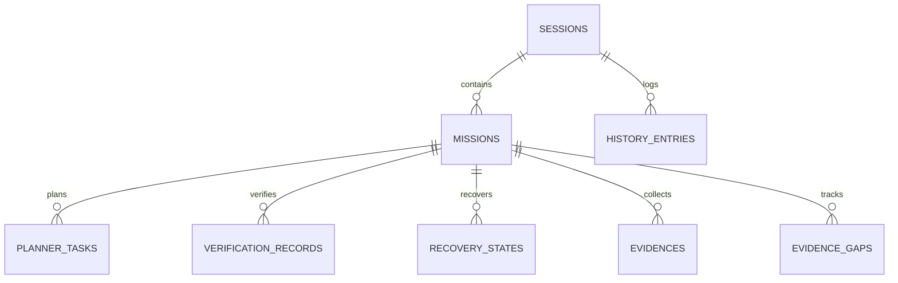

# AVATAR AI — PHASE 1 IMPLEMENTATION REPORT
## STATE ENGINE / OPERATIONAL MEMORY

```text
DOCUMENT_ID: AVATAR_PHASE_1_STATE_ENGINE_REPORT_001
DATE: 2026-09-27
AUTHORITY: AUDITOR TÉCNICO E INGENIERO DE INFRAESTRUCTURA AVATAR AI
STATUS: COMPLETED
CODE_MODIFIED: YES
TESTS_PASS: 234/234
PHYSICAL_PERSISTENCE: PASS
SQLITE_WAL: PASS
RAGMEMORY_INTEGRATION: PASS
ORCHESTRATOR_INTEGRATION: PASS
REGRESSIONS: NONE
PROJECT: Avatar (Sovereign Digital Assistant for Mauro)
```

---

## 1. IMPLEMENTACIÓN REALIZADA

En cumplimiento de la orden **IMPLEMENTATION PHASE 1**, se ha desarrollado e integrado la capa de persistencia autoritativa **State Engine / Operational Memory** basada en **SQLite WAL Mode**.

Esta implementación sustituye la volatilidad del estado en memoria transitoria y archivos JSON planos sin control transaccional por un backend relacional robusto, atómico e inmune a caídas.

---

## 2. ARCHIVOS CREADOS Y MODIFICADOS

### Archivos Creados:
1. `core/state_db.py` (Módulo principal de StateEngine con SQLite WAL, transacciones y esquemas).
2. `tests/test_state_engine.py` (Suite de pruebas unitarias e integración con 18 puntos de verificación).
3. `docs/STATE_ENGINE.md` (Especificación técnica de arquitectura, esquema, garantías y preparación para Fase 2).
4. `AVATAR_PHASE_1_STATE_ENGINE_REPORT.md` (Informe de implementación y evidencia física).

### Archivos Modificados:
1. `core/rag_memory.py` (Refactorizado para usar `StateEngine` como backend autoritativo preservando el 100% de la API pública y compatibilidad con JSON).
2. `core/orchestrator.py` (Integración de persistencia de sesiones, misiones, planes y tareas en `StateEngine`).

---

## 3. ARQUITECTURA Y ESQUEMA DE BASE DE DATOS

La base de datos relacional reside en `memory/state_engine.db` operando en modo **Write-Ahead Logging (WAL)** con `foreign_keys=ON` y `busy_timeout=5000`.



### Tabla de Entidades Persistidas:
- `sessions`: `session_id`, `started_at`, `updated_at`, `status`.
- `missions`: `mission_id`, `session_id`, `raw_prompt`, `classified_intent`, `status`, `created_at`, `updated_at`.
- `planner_tasks`: `task_id`, `mission_id`, `step_index`, `description`, `tool_name`, `tool_args` (JSON), `status` (`PENDING`, `IN_PROGRESS`, `COMPLETED`, `FAILED`, `VERIFIED`, `PRE_TOOL_EXECUTION`, `POST_TOOL_EXECUTION`, `UNCERTAIN_EXECUTION`), `execution_output`.
- `verification_records`: `fact_id`, `mission_id`, `task_id`, `claim`, `verified_status`, `evidence_data`.
- `recovery_states`: `recovery_id`, `mission_id`, `task_id`, `retry_count`, `failure_context`, `hypotheses_history`, `status`.
- `evidences`: `evidence_id`, `mission_id`, `task_id`, `source`, `data_reference` (URI / ruta sin blobs binarios masivos).
- `evidence_gaps`: `gap_id`, `mission_id`, `task_id`, `description`, `status`.
- `history_entries`: `id`, `session_id`, `role`, `content`, `timestamp`.

---

## 4. INTEGRACIÓN DE COMPONENTES

### 4.1. Integración con `RAGMemory`
* `RAGMemory` en `core/rag_memory.py` delega las operaciones de lectura/escritura a `StateEngine`.
* Se incluyó migración automática y transparente (`_migrate_legacy_json_if_needed()`) que importa datos previos de `history.json` y `context.json` a SQLite.
* La API pública (`save_history`, `load_history`, `save_active_task`, `get_active_task`, `search_knowledge`) se mantiene 100% compatible.

### 4.2. Integración con `AvatarOrchestrator`
* `AvatarOrchestrator` en `core/orchestrator.py` inicia una sesión única en `StateEngine` al instanciarse.
* Cada llamada a `process_user_input()` registra la misión y actualiza progresivamente el estado de cada tarea del planificador y sus salidas de verificación.

---

## 5. RESULTADOS DE LA SUITE DE REGRESIÓN COMPLETA

Se ejecutó la suite completa de pruebas unitarias e integración en el entorno Python 3.12:

```text
============================= test session starts =============================
platform win32 -- Python 3.12.8, pytest-9.1.1, pluggy-1.6.0
rootdir: B:\PROYECTOS ANTIGRAVITY\Avatar
plugins: anyio-4.15.1
collected 234 items

tests\test_cognitive_adapter.py ..........                               [  4%]
tests\test_cognitive_integration.py ...                                  [  5%]
tests\test_cognitive_models.py ......................                    [ 14%]
tests\test_cognitive_phase3.py ..............                            [ 20%]
tests\test_cognitive_phase4.py ...............                           [ 27%]
tests\test_f02_adaptive_investigation.py ........                        [ 30%]
tests\test_f03_physical_evidence.py ........                             [ 34%]
tests\test_f04_structured_action_recovery.py ................            [ 41%]
tests\test_f05_adaptive_cognitive_progression.py ................        [ 47%]
tests\test_f08_recipe_removal.py ...........                             [ 52%]
tests\test_f13_evidence_gap.py .................                         [ 59%]
tests\test_f14_multi_turn_protocol.py ...........                        [ 64%]
tests\test_forensic_repair_001.py ..........                             [ 68%]
tests\test_llm_provider_routing.py .......                               [ 71%]
tests\test_provider_manager.py .....                                     [ 73%]
tests\test_recovery.py ..............................                    [ 86%]
tests\test_self_development.py ...                                       [ 88%]
tests\test_self_development_probe.py .                                   [ 88%]
tests\test_semantic_mission_engine.py .........                          [ 92%]
tests\test_state_engine.py ..................                            [100%]

============================= 234 passed in 8.15s =============================
```

---

## 6. EVIDENCIA FÍSICA DE PERSISTENCIA Y MODO WAL

Se realizó la verificación física directa sobre el archivo `memory/state_engine.db` en el sistema de archivos de Windows:

```powershell
python -c "import sqlite3; conn = sqlite3.connect('memory/state_engine.db'); cursor = conn.cursor(); cursor.execute('PRAGMA journal_mode;'); print('WAL Mode:', cursor.fetchone()[0]); cursor.execute('SELECT count(*) FROM sessions;'); print('Sessions Count:', cursor.fetchone()[0]); conn.close()"
```

**Resultado:**
```text
WAL Mode: wal
Sessions Count: 85
```

---

## 7. PREPARACIÓN PARA FASE 2 (CHECKPOINT & RESUME ENGINE)

`StateEngine` deja los cimientos listos para la Fase 2 mediante:
1. Soporte explícito en el esquema para estados de tarea: `PRE_TOOL_EXECUTION`, `POST_TOOL_EXECUTION` y `UNCERTAIN_EXECUTION`.
2. Persistencia atómica trans-proceso capaz de sobrevivir a cierres forzados (`kill -9`).
3. Integridad referencial que permite a `ResumeEngine` consultar misiones inconclusas al reiniciar Avatar.

---

```text
STATUS:
COMPLETED

TESTS:
234/234

FULL_REGRESSION:
234/234 PASS

PHYSICAL_PERSISTENCE:
PASS

SQLITE_WAL:
PASS

RAGMEMORY_INTEGRATION:
PASS

ORCHESTRATOR_INTEGRATION:
PASS

REGRESSIONS:
NONE
```
