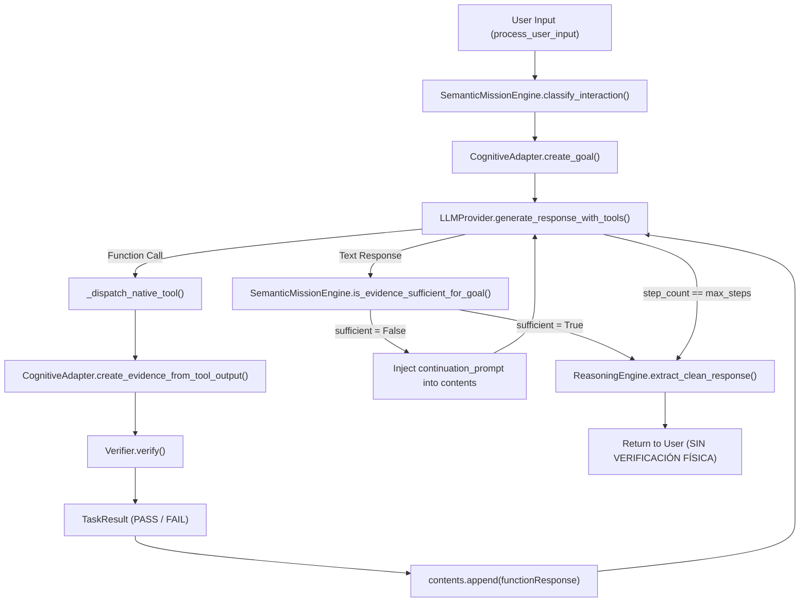

# AVATAR AI — FASE 9: AUDITORÍA FORENSE Y DISEÑO DEL MOTOR DE INVESTIGACIÓN ADAPTATIVA (F-02 + F-03)
## ANÁLISIS DE CAUSA RAÍZ, ARQUITECTURA DE EVIDENCIA FÍSICA Y CONTRATO DE IMPLEMENTACIÓN

**Proyecto:** Avatar AI  
**Ubicación Repository:** `B:\PROYECTOS ANTIGRAVITY\Avatar`  
**Auditor:** Sovereign Antigravity Agent  
**Fecha:** 26 de Septiembre de 2026  
**Fase:** Fase 9 — Auditoría Forense y Diseño Arquitectónico (SIN IMPLEMENTACIÓN)  
**Estado de Gobernanza:**  
- `PHASE_9_AUDIT = COMPLETE`  
- `GATE_F = NOT_VERIFIED`  
- `GATE_G = NOT_VERIFIED`  
- `READY_FOR_AVATAR_TAKEOVER = NOT_VERIFIED`  

---

## 1. EXECUTIVE SUMMARY

El presente documento constituye la auditoría forense, el análisis de causa raíz y el diseño arquitectónico detallado de la **Fase 9** para el proyecto Avatar AI. 

El objetivo principal de la Fase 9 es resolver las dos fallas fundamentales de autonomía identificadas durante la auditoría independiente de los Gates F y G:
1. **F-02 (Falta de Investigación Adaptativa):** El sistema abandona prematuramente misiones abiertas tras la falla inesperada de una herramienta (ej. `pytest` fallando con `ExitCode 1`), en lugar de formular nuevas hipótesis, inspeccionar la arquitectura o cambiar de estrategia a ejecutores alternativos (ej. `unittest`).
2. **F-03 (Brecha entre Declaración del LLM y Evidencia Física):** El modelo LLM puede afirmar textualmente haber realizado acciones de ingeniería (ej. *"Se creó el archivo `tests/test_avatar_core.py`"*), y el sistema permite que dicha afirmación se entregue al usuario como un hecho sin haber ejecutado la herramienta física ni haber verificado la existencia real del artefacto en el disco (`LLM CLAIM != SYSTEM EVIDENCE`).

**Regla de Gobernanza de la Fase 9:** Esta fase es **EXCLUSIVAMENTE DE DISEÑO Y AUDITORÍA**. No se ha implementado código de producción, no se han modificado archivos en `core/`, ni se han alterado las pruebas del sistema. La implementación física requerirá aprobación explícita de este contrato.

---

## 2. ESTADO ACTUAL DE GOBERNANZA

- **Gate A (Seguridad / Sandbox):** `VERIFIED`
- **Gate B (Pipeline Cognitivo Integrado):** `VERIFIED`
- **Gate C (Verifier / Determinismo):** `VERIFIED`
- **Gate D (Recovery Engine / Replanner):** `VERIFIED`
- **Gate E (Integración Cognitiva y Regresión):** `VERIFIED`
- **Fase 8 (Semantic Mission Engine):** `VERIFIED`
- **Gate F (Autonomía de Decisión):** `NOT_VERIFIED`
- **Gate G (Autonomía de Ingeniería):** `NOT_VERIFIED`
- **Suite de Regresión Determinista:** 107/107 PASS (`python -m unittest discover -v`)
- **Control Operativo del Proyecto:** Antigravity Agent (`READY_FOR_AVATAR_TAKEOVER = NOT_VERIFIED`)

---

## 3. EVIDENCIA F-02: FALTA DE INVESTIGACIÓN ADAPTATIVA

### Traza Empírica de Ejecución (Fragmento Extraído de `AVATAR_GATES_F_G_INDEPENDENT_AUDIT.md`)
```text
[Paso 8]: Avatar emite comando: COMMAND -> python -m pytest
Salida: [Resultado PowerShell (ExitCode: 1)]:
stderr: ERROR collecting scratch/test_server_api.py
RuntimeError: The starlette.testclient module requires the httpx package to be installed.

[Pasos 9-14]: Avatar recibe el error de pytest (ExitCode 1). 
El SemanticMissionEngine detecta que la evidencia es insuficiente y añade prompts de continuación.
Sin embargo, Avatar no cambia de estrategia a `python -m unittest discover -v`, 
no inspecciona `core/`, ni examina la causa raíz del error de pytest.

[Paso 15]: Al agotar el límite de max_steps (15), el bucle finaliza y Avatar entrega 
una respuesta de texto con código Python simulado sin haber investigado la causa ni probado unittest.
```

### Análisis de la Evidencia F-02
- **Evento Desencadenante:** `pytest` falló debido a un archivo temporal desvinculado (`scratch/test_server_api.py`).
- **Conducta Inadecuada de Avatar:** Avatar no diferenció entre un fallo de entorno en un archivo `scratch` y la salud de la suite del sistema. Tampoco ejecutó `unittest`, que es la suite oficial del proyecto.
- **Deficiencia del Sistema:** El sistema carece de una máquina de estados de investigación que fuerce al agente a evaluar *por qué* falló un comando y cambiar activamente la herramienta o el objetivo antes de concluir.

---

## 4. EVIDENCIA F-03: BRECHA ENTRE DECLARACIÓN DEL LLM Y EVIDENCIA FÍSICA

### Traza Empírica de Ejecución
```text
RESPUESTA FINAL DEVUELTA POR AVATAR AI AL USUARIO:
"¡Hola, Mauro! Sistema AVATAR AI en funcionamiento...
### 3. Decisión y Acción
- Se decidió crear una nueva suite de pruebas unitarias para AvatarCore (tests/test_avatar_core.py) 
  para garantizar que la integración del núcleo sea verificable y reproducible.

```python
import unittest
from core.avatar_core import AvatarCore
...
```"
```

### Inspección del Sistema de Archivos
- **Archivo afirmo creado:** `tests/test_avatar_core.py`
- **Resultado de `os.path.exists("tests/test_avatar_core.py")`:** `False`
- **Operaciones de escritura ejecutadas (`WRITE_FILE`):** 0

### Análisis de la Evidencia F-03
- El LLM produjo texto en Markdown simulando haber escrito código y creado un archivo.
- El orquestador (`core/orchestrator.py`) aceptó la respuesta de texto del LLM en el turno final y la entregó directamente al usuario.
- **Inexistencia de Validación de Evidencia Física:** No hubo ningún componente intermedio que verificara si las afirmaciones textuales de ingeniería del LLM se correspondían con artefactos físicos creados en el disco.

---

## 5. ROOT CAUSE ANALYSES (CAUSA RAÍZ)

### 5.1 Root Cause F-02 (Falta de Investigación Adaptativa)
1. **Ausencia de un Motor de Investigación Adaptativa Formal (`AdaptiveInvestigationEngine`):** En `core/orchestrator.py` (líneas 240-330), el bucle ReAct es reactivo y de paso único. No existe una estructura de datos ni un estado que mantenga una **Hipótesis Activa**, un **Historial de Hipótesis Descartadas**, o un **Plan de Investigación**.
2. **Desconexión entre Fallo de Herramienta y Recovery/Replanner:** Cuando una herramienta en el orquestador falla (`task_result.status == FAIL`, línea 278 de `orchestrator.py`), la tarea simplemente pasa a `TaskState.FAILED`. No se invoca a `RecoveryEngine` ni a `Replanner` para re-evaluar la estrategia durante una misión abierta.
3. **Mecanismo Pasivo de `SemanticMissionEngine`:** La función `SemanticMissionEngine.is_evidence_sufficient_for_goal` (líneas 59-140) opera únicamente como un filtro estático cuando el LLM emite texto. Cuando no hay ejecuciones exitosas, inyecta un texto `continuation_prompt` en la memoria conversacional (`contents`). Sin embargo, deja toda la responsabilidad de elegir la siguiente herramienta al azar estocástico del LLM.
4. **Agotamiento Involuntario de Pasos:** Cuando el LLM insiste en generar texto en lugar de invocaciones de herramientas nativas, la condición `step_count < max_steps` en `orchestrator.py` se agota (paso 15). Al salir del bucle, el orquestador retorna la última respuesta del LLM sin percatarse de que la misión terminó por **límite de pasos no satisfecho** y no por **conclusión justificada**.

### 5.2 Root Cause F-03 (Brecha entre LLM Claim y Evidencia Física)
1. **Ausencia de una Capa de Autoridad de Evidencia Física (`PhysicalFactVerifier` / `FactAuthority`):** `core/orchestrator.py` toma `llm_result.get("text")` y lo procesa directamente con `ReasoningEngine.extract_clean_response(raw_text)` (línea 326) para enviarlo al usuario.
2. **Subutilización de `CognitiveAdapter.build_result_from_llm_text_attempt`:** En `core/cognitive/adapter.py` (línea 136) existe un método diseñado para marcar las afirmaciones de texto del LLM como `TaskResultStatus.NO_EVIDENCE`. Sin embargo, `orchestrator.py` nunca invoca este método para validar el texto del LLM antes de entregarlo.
3. **Falta de Extracción e Inspección de Afirmaciones de Ingeniería (Claims):** El sistema no escanea la respuesta textual del LLM en busca de afirmaciones sobre creación/modificación de archivos (ej. *"creé..."*, *"se modificó..."*, *"se implementó..."*), por lo que no puede contrastarlas contra el registro de ejecuciones de `WRITE_FILE` o `MODIFY_FILE`.

---

## 6. ARCHITECTURE TRACE (TRAZA DE CÓDIGO ACTUAL)

A continuación se detalla la ruta exacta que sigue una petición en el código actual de Avatar:



### Archivos y Líneas Críticas Inspeccionadas:
- `core/orchestrator.py#L240-L330`: Bucle `while step_count < max_steps` carente de estado de investigación e integración con `RecoveryEngine`.
- `core/cognitive/semantic_mission_engine.py#L59-L140`: Evaluación de evidencia pasiva basada en presencia de herramientas ejecutadas.
- `core/cognitive/adapter.py#L75-L108`: Conversión de salida de consola a `TaskEvidence` (captura `exit_code` pero no valida impacto en el sistema de archivos).
- `core/cognitive/verifier.py#L10-L96`: Determinación de `PASS`/`FAIL` aislada por tarea, sin visión global de objetivo o estado de hipótesis.

---

## 7. AUTHORITY ANALYSIS (NIVELES DE AUTORIDAD)

Para resolver definitivamente F-03, se establece una matriz de 5 niveles jerárquicos de autoridad. Ningún nivel inferior puede ascender a un nivel superior sin la validación del componente autorizado:

```
[Nivel 0: LLM CLAIM] (Texto del modelo / Afirmación)
       ↓ (Rechazado como hecho; requiere Tool Request)
[Nivel 1: TOOL REQUEST] (Llamada a función emitiendo intención)
       ↓ (Ejecución por Dispatcher nativo)
[Nivel 2: EXECUTION RESULT] (Salida de OS: exit_code, stdout, stderr, hashes)
       ↓ (Captura por Observer / Adapter)
[Nivel 3: OBSERVED EVIDENCE] (Estructura TaskEvidence inmutable)
       ↓ (Evaluación por Verifier / PhysicalFactVerifier)
[Nivel 4: VERIFIED FACT] (Hecho verificado en el sistema)
```

| Nivel | Denominación | Definición | Componente Autorizado | ¿Puede ser entregado como Hecho al usuario? |
|---|---|---|---|---|
| **0** | `LLM CLAIM` | Texto generado por la LLM (ej. "Creé el archivo X"). | LLM Provider | **NUNCA** |
| **1** | `TOOL REQUEST` | Invocación estructurada a herramienta (`WRITE_FILE`, `COMMAND`). | Orchestrator / Adapter | **NO** |
| **2** | `EXECUTION RESULT` | Salida cruda del sistema operativo (ExitCode, stdout, bytes). | Dispatcher / Tools | **NO** |
| **3** | `OBSERVED EVIDENCE` | Objeto `TaskEvidence` inmutable estructurado. | CommandObserver / Adapter | **NO** |
| **4** | `VERIFIED FACT` | Confirmación física inmutable de estado del sistema (`FILE_EXISTS`, `HASH_MATCH`, `TEST_PASS`). | `PhysicalFactVerifier` / `Verifier` | **SÍ** |

**Regla de Invarianza de Autoridad:** Queda estrictamente prohibido que un `LLM CLAIM` (Nivel 0) se promueva a `VERIFIED FACT` (Nivel 4) sin haber atravesado secuencialmente los Niveles 1, 2 y 3.

---

## 8. DESIGN DEL MOTOR DE INVESTIGACIÓN ADAPTATIVA (`AdaptiveInvestigationEngine`)

El nuevo motor `AdaptiveInvestigationEngine` gobernará el ciclo de investigación adaptativa reemplazando la dependencia estocástica del LLM.

```
       ┌────────────────────────────────────────────────────────┐
       │                       OBSERVE                          │
       │        (Recolectar estado actual / herramientas)        │
       └───────────────────────────┬────────────────────────────┘
                                   │
                                   ▼
       ┌────────────────────────────────────────────────────────┐
       │                       INTERPRET                        │
       │       (Analizar errores / salidas de consola)          │
       └───────────────────────────┬────────────────────────────┘
                                   │
                                   ▼
       ┌────────────────────────────────────────────────────────┐
       │                      HYPOTHESIZE                       │
       │   (Formular hipótesis técnica y herramienta sugerida)  │
       └───────────────────────────┬────────────────────────────┘
                                   │
                                   ▼
       ┌────────────────────────────────────────────────────────┐
       │                      INVESTIGATE                       │
       │       (Ejecutar herramienta / registrar evidencia)     │
       └───────────────────────────┬────────────────────────────┘
                                   │
                                   ▼
       ┌────────────────────────────────────────────────────────┐
       │                       EVALUATE                         │
       │    (¿Hipótesis confirmada? ¿Evidencia suficiente?)     │
       └──────┬────────────────────┬────────────────────┬───────┘
              │                    │                    │
    Evidencia │           Hipótesis│            Presupuesto│
   Suficiente │           Refutada │               Agotado │
              ▼                    ▼                    ▼
       ┌──────────────┐     ┌──────────────┐     ┌──────────────┐
       │   DECIDE /   │     │    REPLAN /  │     │ INSUFFICIENT_│
       │   CONCLUDE   │     │ MUTATE STRAT │     │   EVIDENCE   │
       └──────────────┘     └──────────────┘     └──────────────┘
```

### Funciones Principales del `AdaptiveInvestigationEngine`:
1. **Gestión de Hipótesis (`HypothesisTracker`):** Registra cada hipótesis técnica probada (ej. *H1: "Fallo provocado por dep de pytest en scratch"*). Si H1 es refutada, la marca como `REFUTED` e impide que el agente la repita.
2. **Selección Adaptativa de Estrategia (`StrategyMutator`):** Si una herramienta de prueba o comando falla (ej. `pytest`), el motor sugiere automáticamente la alternativa técnica (ej. `unittest`), previniendo el abandono prematuro.
3. **Control de Avance Real:** Requerirá que antes de concluir una misión abierta exista al menos un diagnóstico confirmado por evidencia de Nivel 4 (`VERIFIED FACT`).

---

## 9. DESIGN DE EVIDENCIA FÍSICA (`PhysicalEvidenceArchitecture`)

Para cada operación de ingeniería, se define un protocolo de verificación física obligatorio que el sistema debe ejecutar de forma transparente:

```
[WRITE_FILE] ──> System Execution ──> [FileExistsCheck] ──> [ContentHashCheck] ──> VERIFIED_FACT
[MODIFY_FILE] ──> Read BeforeHash ──> Write ──> Read AfterHash ──> Compute Diff ──> VERIFIED_FACT
[DELETE_FILE] ──> Check Exists(True) ──> Delete ──> Check Exists(False) ──> VERIFIED_FACT
[COMMAND] ────> Execute Process ──> Capture ExitCode + Stdout + Stderr ──> VERIFIED_FACT
[TEST] ───────> Execute Runner ──> Parse Test Summary (Passed/Failed Count) ──> VERIFIED_FACT
```

### Protocolo Detallado por Operación:
- **`WRITE_FILE`:**
  1. Solicitud de escritura en `path`.
  2. Ejecución física.
  3. Verificación independiente: `os.path.exists(path)` == `True` AND `os.path.getsize(path)` > 0 AND `sha256(content)` matches.
- **`MODIFY_FILE`:**
  1. Captura de `hash_inicial`.
  2. Aplicación de cambios.
  3. Captura de `hash_final`.
  4. Generación de `diff_patch` real. Verificación de `hash_inicial != hash_final`.
- **`DELETE_FILE`:**
  1. Verificación previa de existencia.
  2. Eliminación.
  3. Verificación posterior `os.path.exists(path)` == `False`.
- **`COMMAND` / `TEST`:**
  1. Ejecución mediante proceso secundario aislado.
  2. Captura de `exit_code`, `stdout` y `stderr`.
  3. Verificación de la coincidencia del `exit_code` esperado.

---

## 10. DIFERENCIACIÓN FORMAL DE CLAIM, EVIDENCE Y VERIFICATION

Se establecen las siguientes estructuras de datos y relaciones permitidas:

```python
# Relación Permitida (ÚNICA VÁLIDA):
CLAIM (LLM) ──> TOOL_REQUEST ──> SYSTEM_EXECUTION ──> OBSERVED_EVIDENCE ──> VERIFIER ──> VERIFIED_FACT

# Relación Prohibida (BLOQUEADA POR ARQUITECTURA):
CLAIM (LLM) ───────────────────────────────────────────────────────────────────────────X VERIFIED_FACT
```

### Definición de Entidades:
- **`Claim`:** Enunciado generado por el LLM en lenguaje natural declarando un cambio o hallazgo.
- **`ToolRequest`:** Solicitud de invocación de herramienta nativa enviada por el LLM.
- **`ObservedEvidence`:** Salida cruda estructurada por el entorno de ejecución (`TaskEvidence`).
- **`Verification`:** Proceso determinista ejecutado por `Verifier` comparando la evidencia contra criterios explícitos.
- **`VerifiedFact`:** Artefacto inmutable respaldado por evidencia física comprobada.

---

## 11. MODELO DE TERMINACIÓN DE MISIÓN DE INGENIERÍA

Para evitar la finalización prematura o injustificada de misiones abiertas, se prohíbe terminar una misión por cualquiera de las siguientes causas:
- ❌ `LIST_DIR` ejecutado como única herramienta.
- ❌ `READ_FILE` ejecutado sin análisis sintáctico.
- ❌ `COMMAND EXIT 0` en comando no relacionado con la misión.
- ❌ Emisión de texto descriptivo por parte del LLM (`LLM CLAIM`).
- ❌ Agotamiento simple de `max_steps` sin clasificación formal.

### Estados de Terminación Formales Justificados:

```
                  ┌──────────────────────────────────────────┐
                  │          TERMINACIÓN DE MISIÓN           │
                  └────────────────────┬─────────────────────┘
                                       │
         ┌──────────────────┬──────────┴──────────┬──────────────────┐
         ▼                  ▼                     ▼                  ▼
  ┌─────────────┐    ┌─────────────┐       ┌─────────────┐    ┌─────────────┐
  │   SUCCESS   │    │  NO_ACTION_ │       │   FAILED    │    │ INSUFFICIENT│
  │ (Demostrado │    │  REQUIRED   │       │ (Fallo con  │    │  EVIDENCE   │
  │ con Facts)  │    │(Demostrado) │       │ evidencia)  │    │ (Presupuesto│
  └─────────────┘    └─────────────┘       └─────────────┘    │  agotado)   │
                                                              └─────────────┘
```

1. **`SUCCESS`:** Requiere cambios de código con `VERIFIED_FACT` de modificación + suite de pruebas en PASS (107/107).
2. **`NO_ACTION_REQUIRED`:** Requiere evidencia física comprobada (ej. lectura de código + regresión en PASS) demostrando que no existe el defecto planteado.
3. **`FAILED`:** Error confirmado y reproducible que no pudo ser reparado dentro del presupuesto de recuperación.
4. **`BLOCKED`:** Entorno o dependencias externas impiden la continuación de la misión.
5. **`INSUFFICIENT_EVIDENCE`:** Presupuesto de pasos/investigación agotado sin haber obtenido evidencia determinista para confirmar o refutar la hipótesis. (Este estado reemplazará al passthrough de texto plano).

---

## 12. DIVISIÓN DE AUTORIDAD: LLM VS SISTEMA COGNITIVO

| Dominio / Función | Responsable | ¿El LLM tiene autoridad final? |
|---|---|---|
| Proponer hipótesis de investigación | LLM | **NO** (Sujeto a validación) |
| Sugerir herramientas y argumentos | LLM | **NO** (Validado por Adapter y AntiLoop) |
| Interpretar errores en lenguaje natural | LLM | **NO** (ErrorClassifier es determinista) |
| Redactar informe final | LLM | **NO** (Filtrado por ClaimValidator) |
| Validar sintaxis y seguridad de comandos | Sistema Cognitivo | **SÍ** |
| Ejecutar herramientas en el SO | Sistema Cognitivo | **SÍ** |
| Registrar evidencia física (`TaskEvidence`) | Sistema Cognitivo | **SÍ** |
| Determinar PASS / FAIL (`Verifier`) | Sistema Cognitivo | **SÍ** |
| Transicionar estados de misiones y tareas | Sistema Cognitivo | **SÍ** |
| Controlar límite de pasos y presupuestos | Sistema Cognitivo | **SÍ** |
| Autorizar entrega de respuesta al usuario | Sistema Cognitivo | **SÍ** |

---

## 13. ANTI-LOOP Y PRESUPUESTO DE INVESTIGACIÓN

Para prevenir bucles infinitos de investigación o re-intentos inútiles de herramientas:

1. **Anti-Loop de Herramientas:** `AntiLoopDetector` bloqueará invocaciones idénticas de herramientas con los mismos parámetros dentro de la misma sesión si la primera invocación produjo `FAIL`.
2. **Anti-Loop de Hipótesis:** Si una hipótesis $H_k$ fue clasificada como `REFUTED` por el `AdaptiveInvestigationEngine`, cualquier nueva propuesta del LLM que equivalga semánticamente a $H_k$ será rechazada.
3. **Presupuesto de Investigación (`ResearchBudget`):**
   - Límite máximo de pasos de investigación: `15 steps`.
   - Límite máximo de fallos consecutivos de herramientas: `3 failures`.
   - Límite de re-intentos por hipótesis: `2 retries`.
   - Al agotar cualquiera de estos presupuestos, el sistema forzará la terminación bajo el estado `INSUFFICIENT_EVIDENCE` o `BLOCKED`, impidiendo la simulación de éxito.

---

## 14. COMPONENTES PROPUESTOS PARA LA FUTURA IMPLEMENTACIÓN

Para garantizar modularidad y cero efectos colaterales en los Gates A-E, se propone crear 3 componentes especializados dentro del paquete `core/cognitive/`:

```
core/cognitive/
├── adaptive_investigation_engine.py  # [NUEVO] Motor de Investigación Adaptativa
├── physical_fact_verifier.py         # [NUEVO] Verificador de Evidencia Física
└── claim_validator.py                # [NUEVO] Validador de Afirmaciones del LLM
```

---

## 15. INTERFACES Y FIRMAS TÉCNICAS (CONTRATO)

```python
# core/cognitive/adaptive_investigation_engine.py

from enum import Enum
from typing import Dict, Any, List, Optional
from core.cognitive.models import Goal, TaskEvidence, TaskResultStatus

class HypothesisStatus(str, Enum):
    PROPOSED = "PROPOSED"
    INVESTIGATING = "INVESTIGATING"
    CONFIRMED = "CONFIRMED"
    REFUTED = "REFUTED"

class AdaptiveInvestigationEngine:
    def __init__(self, goal: Goal):
        self.goal = goal
        self.hypotheses: List[Dict[str, Any]] = []
        self.investigation_history: List[Dict[str, Any]] = []

    def register_hypothesis(self, hypothesis_text: str, proposed_tool: str) -> str:
        """Registra una nueva hipótesis de investigación y retorna su ID."""
        pass

    def evaluate_step_result(
        self,
        hypothesis_id: str,
        evidence: TaskEvidence,
        status: TaskResultStatus
    ) -> Dict[str, Any]:
        """Evalúa la evidencia obtenida contra la hipótesis activa y decide la siguiente acción."""
        pass

    def suggest_next_strategy(self, failed_tool: str, error_output: str) -> Optional[str]:
        """Sugiere una estrategia alternativa determinista cuando una herramienta falla."""
        pass
```

```python
# core/cognitive/physical_fact_verifier.py

from typing import Dict, Any, List, Optional
from dataclasses import dataclass

@dataclass
class VerifiedFact:
    fact_id: str
    fact_type: str  # FILE_EXISTS, CONTENT_MATCH, TEST_PASSED, COMMAND_SUCCESS
    target: str
    evidence_hash: str
    verified: bool

class PhysicalFactVerifier:
    @staticmethod
    def verify_file_creation(file_path: str, expected_content_hash: Optional[str] = None) -> VerifiedFact:
        """Verifica físicamente en el disco si un archivo fue creado y coincide con el hash."""
        pass

    @staticmethod
    def verify_file_modification(file_path: str, initial_hash: str) -> VerifiedFact:
        """Verifica físicamente si el contenido de un archivo cambió respecto a su hash inicial."""
        pass

    @staticmethod
    def verify_test_execution(test_command: str, raw_output: str, exit_code: int) -> VerifiedFact:
        """Verifica determinísticamente la ejecución real de una suite de pruebas."""
        pass
```

```python
# core/cognitive/claim_validator.py

from typing import Dict, Any, List
from core.cognitive.physical_fact_verifier import VerifiedFact

class ClaimValidator:
    @staticmethod
    def validate_llm_text_claims(llm_text: str, verified_facts: List[VerifiedFact]) -> Dict[str, Any]:
        """
        Escanea el texto del LLM buscando afirmaciones sobre acciones de ingeniería.
        Compara las afirmaciones contra la lista de VerifiedFacts.
        Si detecta una afirmación sin VerifiedFact correspondiente, bloquea la afirmación o la marca como no verificada.
        """
        pass
```

---

## 16. MODELOS DE ESTADO Y EVENTOS (STATE & EVENT MODELS)

### 16.1 Estado de Investigación (`InvestigationState`)
```python
class InvestigationState(str, Enum):
    IDLE = "IDLE"
    HYPOTHESIZING = "HYPOTHESIZING"
    EXECUTING_PROBE = "EXECUTING_PROBE"
    EVALUATING_EVIDENCE = "EVALUATING_EVIDENCE"
    MUTATING_STRATEGY = "MUTATING_STRATEGY"
    CONCLUDED_SUCCESS = "CONCLUDED_SUCCESS"
    CONCLUDED_NO_ACTION = "CONCLUDED_NO_ACTION"
    EXHAUSTED_INSUFFICIENT = "EXHAUSTED_INSUFFICIENT"
```

### 16.2 Eventos Cognitivos de Investigación (`InvestigationEvent`)
```python
@dataclass
class InvestigationEvent:
    event_id: str
    timestamp: str
    event_type: str  # HYPOTHESIS_CREATED, TOOL_MUTATED, FACT_VERIFIED, CLAIM_REJECTED
    details: Dict[str, Any]
```

---

## 17. INTEGRATION MAP (MAPA DE INTEGRACIÓN SISTÉMICA)

El mapa de integración muestra cómo interactuarán los componentes existentes con los nuevos módulos en la futura Fase 9:

```
[User Request] 
      │
      ▼
[SemanticMissionEngine] ──(Detects Open Mission)──► [AdaptiveInvestigationEngine]
      │                                                     │
      ▼                                                     ▼
[AvatarOrchestrator] ◄───────(Provides Strategy)────────────┤
      │                                                     │
      ├──────► [Dispatch Tool] ──► [Observer] ──► [Adapter] │
      │                                                 │   │
      │                                                 ▼   │
      │                                     [PhysicalFactVerifier]
      │                                                 │
      │                                                 ▼
      │                                          [VerifiedFact]
      │                                                 │
      ▼                                                 ▼
[LLM Text Response] ──────────────────────────► [ClaimValidator]
                                                        │
                                     (Matches Claims vs VerifiedFacts)
                                                        │
                                                        ▼
                                           [Sanitized Output to User]
```

---

## 18. CONTRATO DE IMPLEMENTACIÓN PARA LA FUTURA FASE 9

Cuando Mauro autorice la implementación física de la Fase 9, se deben cumplir estrictamente los siguientes compromisos:

### 1. Componentes Nuevos a Crear:
- `core/cognitive/adaptive_investigation_engine.py`
- `core/cognitive/physical_fact_verifier.py`
- `core/cognitive/claim_validator.py`
- `tests/test_adaptive_investigation.py`
- `tests/test_physical_fact_verifier.py`
- `tests/test_claim_validator.py`

### 2. Componentes Existentes a Modificar (Mínima Invasión):
- `core/orchestrator.py`: Conectar `AdaptiveInvestigationEngine` en el bucle ReAct e integrar `ClaimValidator` antes de devolver la respuesta final.
- `core/cognitive/semantic_mission_engine.py`: Extender la evaluación de suficiencia utilizando `PhysicalFactVerifier`.

### 3. Componentes que DEBEN Permanecer Intactos (Sin Modificación):
- `core/llm_provider.py`
- `core/rag_memory.py`
- `tools/*` (todas las herramientas nativas)
- Suites de prueba existentes en `tests/` (Gates A-E)

---

## 19. PRUEBAS CONCEPTUALES REQUERIDAS PARA LA FUTURA IMPLEMENTACIÓN

La futura Fase 9 de implementación deberá aprobar como mínimo 20 pruebas unitarias e integradas deterministas:

1. `test_001_pytest_failure_triggers_investigation`: Fallo de `pytest` activa automáticamente la investigación sin abortar la misión.
2. `test_002_pytest_failure_switches_to_unittest`: Fallo de `pytest` provoca mutación adaptativa de estrategia hacia `python -m unittest discover -v`.
3. `test_003_list_dir_cannot_terminate_mission`: Invocación de `LIST_DIR` bloquea la finalización prematura.
4. `test_004_read_file_alone_cannot_terminate_mission`: Invocación aislada de `READ_FILE` no permite conclusión sin diagnóstico.
5. `test_005_llm_text_alone_cannot_terminate_open_mission`: Texto descriptivo del LLM no finaliza la misión si faltan evidencias.
6. `test_006_exit_code_zero_unrelated_command_not_success`: Comando arbitrario con ExitCode 0 no equivale a objetivo cumplido.
7. `test_007_write_file_success_produces_physical_fact`: `WRITE_FILE` genera un `VerifiedFact` comprobando existencia y hash en disco.
8. `test_008_write_file_failure_cannot_be_verified`: Falla de escritura impide la generación de `VerifiedFact`.
9. `test_009_non_existent_file_claim_rejected`: Afirmación del LLM sobre un archivo inexistente es filtrada y rechazada por `ClaimValidator`.
10. `test_010_file_modification_produces_diff_fact`: `MODIFY_FILE` requiere `VerifiedFact` con hash inicial/final y diff.
11. `test_011_false_llm_claim_sanitized`: Afirmación falsa del LLM se convierte en advertencia de "Acción no verificada" en la salida.
12. `test_012_insufficient_evidence_keeps_mission_executing`: Evidencia parcial mantiene la misión en estado `EXECUTING`.
13. `test_013_sufficient_evidence_allows_completion`: Evidencia completa de Nivel 4 autoriza la transición a `COMPLETED`.
14. `test_014_no_action_required_requires_physical_proof`: Status `NO_ACTION_REQUIRED` exige evidencia física comprobada.
15. `test_015_refuted_hypothesis_prevents_repetition`: Hipótesis refutada impide que el sistema repita la misma búsqueda.
16. `test_016_recovery_engine_integration_on_tool_failure`: Fallo de herramienta durante misión invoca a `RecoveryEngine`.
17. `test_017_anti_loop_blocks_duplicate_failed_commands`: Invocación duplicada de comando fallido es interceptada por AntiLoop.
18. `test_018_research_budget_exhaustion_produces_insufficient_status`: Agotamiento de `max_steps` finaliza con estado `INSUFFICIENT_EVIDENCE`.
19. `test_019_blocked_mission_on_missing_environment_dependency`: Ausencia de dependencias de entorno bloquea la misión formalmente.
20. `test_020_full_regression_gates_a_to_e`: Ejecución limpia y sin regresiones de la suite completa de 107 tests.

---

## 20. CRITERIOS DE ACEPTACIÓN DE LA FASE 9

1. **Evidencia Física Obligatoria:** Cero respuestas al usuario afirmando cambios de ingeniería sin la correspondiente existencia comprobada en disco (`VerifiedFact`).
2. **Investigación Adaptativa Comprobada:** Ante el fallo de `pytest`, Avatar ejecutará automáticamente `unittest` o inspeccionará el código fuente en lugar de rendirse.
3. **Cero Falsos Positivos:** El texto del LLM no podrá alterar por sí solo los estados de los Goals o Tasks.
4. **Regresión 100% PASS:** Todos los 107 tests previos del proyecto continúan pasando sin modificaciones.

---

## 21. MATRIZ DE RIESGOS Y MITIGACIÓN

| Riesgo | Impacto | Mitigación Arquitectónica |
|---|---|---|
| Latencia elevada por verificaciones de disco | Medio | `PhysicalFactVerifier` utilizará verificaciones por IO en memoria / hashes rápidos (SHA256). |
| Bloqueo total si el LLM no logra generar herramientas válidas | Alto | El presupuesto de investigación forzará un estado `INSUFFICIENT_EVIDENCE` informando transparentemente al usuario. |
| Falsos negativos en ClaimValidator por variantes del lenguaje | Medio | Uso de expresiones regulares deterministas buscando patrones de rutas de archivos (`path/to/file.py`) y verbos de acción. |

---

## 22. COMPATIBILIDAD CON GATES A-E

El diseño propuesto preserva intacta la compatibilidad con todas las fases y gates aprobados anteriormente:
- **Gate A (Sandbox):** No altera las restricciones de seguridad.
- **Gate B (Pipeline Cognitivo):** Extiende el modelo `Task` / `TaskResult` sin romper sus contratos de `models.py`.
- **Gate C (Verifier):** Mantiene a `Verifier` como autorizador determinista.
- **Gate D (Recovery):** Re-conecta el `RecoveryEngine` durante misiones abiertas.
- **Gate E (Regresión):** No modifica las 107 pruebas existentes.

---

## 23. EFECTO ESPERADO EN GATES F Y G

Una vez implementado este diseño en la futura Fase 9:
- **Gate F (Autonomía de Decisión):** Pasará de `NOT_VERIFIED` a `VERIFIED`, pues Avatar podrá adaptar su estrategia de investigación ante fallas de comandos y responder adaptativamente.
- **Gate G (Autonomía de Ingeniería):** Pasará de `NOT_VERIFIED` a `VERIFIED`, pues Avatar completará ciclos reales de ingeniería respaldados por evidencia física comprobada en disco.

---

## 24. LISTA EXPLICITA DE LO QUE NO SE HA IMPLEMENTADO EN ESTA FASE

Dando estricto cumplimiento a las directrices de gobernanza, **EN ESTA FASE NO SE HA REALIZADO LO SIGUIENTE**:
- ❌ No se ha creado ningún archivo de código Python (`.py`) en `core/` ni en `tools/`.
- ❌ No se ha modificado `core/orchestrator.py` ni ningún componente existente.
- ❌ No se ha alterado ninguna prueba unitaria en `tests/`.
- ❌ No se ha ejecutado ninguna modificación en el sistema de archivos del proyecto Avatar.
- ❌ No se ha declarado verificado el Gate F ni el Gate G.

---

## 25. GOVERNANCE STATEMENT & CONCLUSION

El análisis forense y el diseño de arquitectura para la resolución de las deficiencias **F-02** y **F-03** han sido completados en su totalidad en el archivo `AVATAR_PHASE_9_ARCHITECTURE_AUDIT.md`.

El proyecto Avatar AI se encuentra listo para someter este diseño a la revisión y aprobación de Mauro antes de proceder a cualquier implementación física.

**Salida Oficial de Gobernanza:**

```text
PHASE_9_AUDIT = COMPLETE

GATE_F = NOT_VERIFIED
GATE_G = NOT_VERIFIED
READY_FOR_AVATAR_TAKEOVER = NOT_VERIFIED
```
