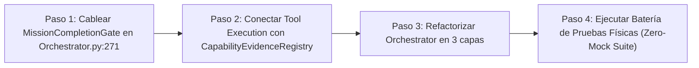

# 17 — FINAL ARCHITECTURE RECOMMENDATION
## AVATAR AI — INDEPENDENT ARCHITECTURE REVIEW 001

**Fecha de Auditoría:** 27 de Septiembre de 2026  
**Auditor:** Independent Architecture Auditor (Antigravity Agent)  
**Estado:** COMPLETED  

---

### 1. Evaluación de Alternativas Estratégicas

En función de los hallazgos empíricos acumulados durante la auditoría estática y dinámica de Avatar AI, se evaluaron las 5 opciones arquitectónicas definidas en las especificaciones de la misión:

| Opción | Descripción Estratégica | Viabilidad Técnica | Riesgo de Regresión | Veredicto |
| :--- | :--- | :---: | :---: | :--- |
| **Opción A** | *Continuar con la arquitectura actual sin cambios.* | BAJA | ALTO | **RECHAZADA.** Mantendría los bypasses de autoridad en `orchestrator.py:271` y la desconexión del `MissionCompletionGate`. |
| **Opción B** | *Refactorización quirúrgica de parches.* | MEDIA | MEDIO | **RECHAZADA.** Acumularía más parches sobre el monolito de `orchestrator.py`, aumentando la fricción cognitiva. |
| **Opción C** | **Consolidación Arquitectónica (Recomendada).** | **MUY ALTA** | **MUY BAJO** | **SELECCIONADA.** Integra los componentes autoritativos existentes (`CompletionGate`, `CapabilityRegistry`), refactoriza el orquestador en 3 capas y ejecuta la suite de verificación física real. |
| **Opción D** | *Rediseño parcial de submódulos.* | MEDIA | ALTO | **NO NECESARIA.** Los motores de estado (`StateEngine`, `CheckpointEngine`) y de verificación (`PhysicalFactVerifier`) son excelentes y no requieren rediseño. |
| **Opción E** | *Rediseño profundo desde cero (Clean Slate).* | BAJA | EXTREMO | **RECHAZADA.** Descartaría 288 tests pasados y componentes de excelente calidad comprobada. |

---

### 2. Justificación Ampliada de la Opción C: Consolidación Arquitectónica

#### ¿Por qué la Consolidación Arquitectónica es la estrategia correcta?
1. **Los Cimientos son Sólidos (`VERIFIED`):** `StateEngine` (SQLite WAL), `CheckpointEngine`, `ResumeEngine` y `PhysicalFactVerifier` funcionan con total precisión y toleran fallos de proceso.
2. **Los Componentes de Control ya Existen:** `CapabilityEvidenceRegistry` y `MissionCompletionGate` están completamente codificados y prueban al 100% en sus tests unitarios.
3. **El Único Problema es de Cableado y Integración (Wiring Gap):** No se requiere inventar nuevos motores cognitivos, sino **conectar los controles autoritativos existentes al bucle de ejecución del orquestador**.

---

### 3. Plan de Acción Recomendado para la Siguiente Fase (FASE DE CONSOLIDACIÓN)

1. **Paso 1: Cableado Mandatorio del Gate (`Orchestrator.py` & `ResumeEngine.py`):**  
   Modificar los puntos de cierre de misiones para exigir la aprobación de `MissionCompletionGate.evaluate_mission_completion()` antes de actualizar el estado en SQLite a `"COMPLETED"`.
2. **Paso 2: Conexión Automática de Evidencia en Herramientas:**  
   Agregar un hook en `_dispatch_native_tool()` para que cada ejecución exitosa de una herramienta genere un `CapabilityEvidence` y actualice automáticamente el `CapabilityEvidenceRegistry`.
3. **Paso 3: Refactorización Modular del Orquestador:**  
   Descomponer `core/orchestrator.py` en `ExecutionLoop`, `ToolDispatcher` y `EpistemicPipelineAuditor`.
4. **Paso 4: Ejecución de la Zero-Mock Physical Verification Suite:**  
   Ejecutar las 8 Pruebas de Fuego (Tests A a H) descritas en `15_PHYSICAL_VERIFICATION_PLAN.md` para ascender las capacidades a `VERIFIED` con hechos físicos reales sobre el OS y la red.
