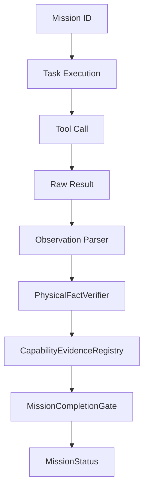

# AVATAR AI — EVIDENCE CHAIN OF CUSTODY AUDIT (002)

## 1. CONCEPTO DE CADENA DE CUSTODIA

La Cadena de Custodia en Avatar AI representa el rastreo inquebrantable de origen y transformación de cada fragmento de evidencia, desde la intención inicial de la misión hasta la evaluación final en el `MissionCompletionGate`.

---

## 2. AUDITORÍA PASO A PASO DE TRANSICIONES



### Tabla de Auditoría por Fase de Transición:

| Transición | Estado de Custodia | Mecanismo de Control | Brecha Detectada |
| :--- | :--- | :--- | :--- |
| **Mission -> Task** | `PRESENT` | `StateEngine.create_task_session()` | Ninguna |
| **Task -> Action** | `PRESENT` | `Planner` & `SemanticMissionEngine` | Ninguna |
| **Action -> Tool Execution** | `PRESENT` | `AvatarOrchestrator._execute_tool()` | Ninguna |
| **Tool Execution -> Tool Result**| `PRESENT` | Retorno nativo de herramientas | Ninguna |
| **Tool Result -> Observation** | `PRESENT` | Captura de stdout / imagen PNG / DOM | Ninguna |
| **Observation -> Verification** | `PRESENT` | `PhysicalFactVerifier` | Ninguna |
| **Verification -> Evidence** | `AMBIGUOUS` | `CapabilityEvidence` dataclass | La dataclass no incluye `mission_id` / `task_id` |
| **Evidence -> Capability** | `PRESENT` | `CapabilityEvidenceRegistry.register_evidence()` | Deduplica por `evidence_id` |
| **Capability -> Gate** | `PRESENT` | `MissionCompletionGate.evaluate_mission_completion()` | Requiere todas las capacidades en `VERIFIED` |
| **Gate -> Final State** | `PRESENT` | `StateEngine.update_mission_status()` | Ninguna |

---

## 3. IDENTIFICACIÓN Y RECOMENDACIÓN DE MEJORA

### Hallazgo:
La estructura de datos `CapabilityEvidence` ([core/cognitive/capability_registry.py](file:///b:/PROYECTOS%20ANTIGRAVITY/Avatar/core/cognitive/capability_registry.py)) contiene:
- `evidence_id`, `capability_id`, `action`, `expected`, `actual`, `evidence_type`, `physical_evidence`, `source`, `timestamp`, `verification_result`, `verifier`.

### Brecha Identificada:
Falta la asociación explícita con el identificador de la misión activa (`mission_id`) y el identificador de tarea (`task_id`).

### Solución Recomendada (Futura Actualización):
Extender la definición de `CapabilityEvidence` con:
```python
mission_id: Optional[str] = None
task_id: Optional[str] = None
```
Esto garantizará la invalidez automática de evidencias pertenecientes a misiones anteriores tras un cambio de contexto.
