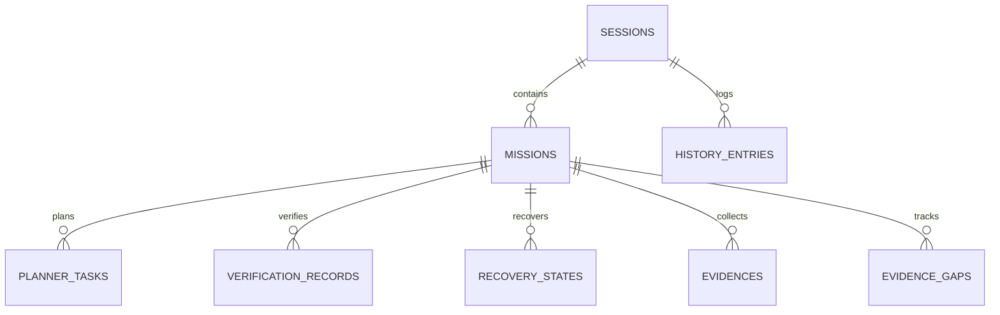

# AVATAR AI — STATE ENGINE / OPERATIONAL MEMORY (FASE 1)
## DOCUMENTACIÓN TÉCNICA Y ESPECIFICACIÓN DE PERSISTENCIA AUTORITATIVA

```text
COMPONENT: StateEngine (core/state_db.py)
BACKEND: SQLite 3 (WAL Mode - Write-Ahead Logging)
LOCATION: memory/state_engine.db
PHASE: Phase 1 (Operational Memory Foundation)
AUTHORITY: CAPA PERSISTENTE AUTORITATIVA DE ESTADO DE AVATAR AI
```

---

## 1. ARQUITECTURA GENERAL

`StateEngine` (`core/state_db.py`) constituye la capa de persistencia relacional autoritativa para el estado operacional de Avatar AI.

Reemplaza la fragilidad de las estructuras de memoria volátil y archivos JSON planos sin control transaccional, proporcionando:

* **SQLite WAL Mode (`journal_mode=WAL`):** Permite lecturas concurrentes sin bloquear escrituras y ofrece alta disponibilidad durante ejecuciones multi-tarea.
* **Integridad Referencial (`foreign_keys=ON`):** Restricciones de llaves foráneas en cascada que garantizan que tareas, evidencias y registros de verificación permanezcan vinculados a sesiones y misiones válidas.
* **Tolerancia a Bloqueos (`busy_timeout=5000`):** Reintentos automáticos durante contención de concurrencia.
* **Concurrencia Segura (`threading.Lock`):** Mutex interno de Python que protege la conexión SQLite de colisiones entre hilos.



---

## 2. ESQUEMA DE BASE DE DATOS Y ENTIDADES

### 2.1. `sessions`
Registra el ciclo de vida de las sesiones del proceso de Avatar.
* `session_id` (TEXT PRIMARY KEY): Identificador único (`sess_...`).
* `started_at` (TEXT NOT NULL): Timestamp ISO 8601 UTC.
* `updated_at` (TEXT NOT NULL): Timestamp de última actividad.
* `status` (TEXT NOT NULL): Estado de la sesión (`ACTIVE`, `PAUSED`, `COMPLETED`, `FAILED`).

### 2.2. `missions`
Registra las misiones o intenciones clasificadas recibidas por el orquestador.
* `mission_id` (TEXT PRIMARY KEY): Identificador único (`msn_...`).
* `session_id` (TEXT NOT NULL, FK -> `sessions.session_id`).
* `raw_prompt` (TEXT NOT NULL): Prompt original ingresado por Mauro.
* `classified_intent` (TEXT NOT NULL): Intención semántica (`DIRECT_ACTION`, `OPEN_ENGINEERING_MISSION`, `CONVERSATIONAL`, etc.).
* `status` (TEXT NOT NULL): Estado (`PENDING`, `IN_PROGRESS`, `COMPLETED`, `FAILED`, `VERIFIED`).

### 2.3. `planner_tasks`
Almacena el grafo de tareas generadas por el planificador (`Planner`).
* `task_id` (TEXT PRIMARY KEY): Identificador de tarea (`T1_...`).
* `mission_id` (TEXT NOT NULL, FK -> `missions.mission_id`).
* `step_index` (INTEGER NOT NULL): Número de orden en el plan.
* `description` (TEXT NOT NULL): Descripción explicativa de la tarea.
* `tool_name` (TEXT NOT NULL): Nombre de la herramienta a invocar (`COMMAND`, `WRITE_FILE`, etc.).
* `tool_args` (TEXT NOT NULL): Argumentos en formato JSON serializado.
* `status` (TEXT NOT NULL): Estados soportados (`PENDING`, `IN_PROGRESS`, `COMPLETED`, `FAILED`, `VERIFIED`, `PRE_TOOL_EXECUTION`, `POST_TOOL_EXECUTION`, `UNCERTAIN_EXECUTION`).
* `execution_output` (TEXT DEFAULT ''): Resultado o salida capturada de la herramienta.

### 2.4. `verification_records`
Registra dictámenes físicos de verificación emitidos por `Verifier` o `PhysicalFactVerifier`.
* `fact_id` (TEXT PRIMARY KEY): Identificador único (`fact_...`).
* `mission_id` (TEXT NOT NULL, FK -> `missions.mission_id`).
* `task_id` (TEXT, FK -> `planner_tasks.task_id`).
* `claim` (TEXT NOT NULL): Afirmación o hipótesis evaluada.
* `verified_status` (TEXT NOT NULL): Estado (`PASS`, `FAIL`, `UNVERIFIED`).
* `evidence_data` (TEXT NOT NULL): Evidencia en JSON string.

### 2.5. `recovery_states`
Registra el estado de recuperación de errores gestionado por `RecoveryEngine`.
* `recovery_id` (TEXT PRIMARY KEY): Identificador (`rec_...`).
* `mission_id` (TEXT NOT NULL, FK -> `missions.mission_id`).
* `retry_count` (INTEGER DEFAULT 0): Contador de reintentos acumulados.
* `failure_context` (TEXT NOT NULL): Contexto estructurado del fallo o traceback.
* `hypotheses_history` (TEXT NOT NULL): Histórico de hipótesis formuladas (JSON array).
* `status` (TEXT NOT NULL): Estado de la recuperación (`ACTIVE`, `RESOLVED`, `EXHAUSTED`).

### 2.6. `evidences` & `evidence_gaps`
* `evidences`: Almacena referencias o URIs a artefactos, logs o capturas (sin incluir binarios masivos dentro del archivo SQLite).
* `evidence_gaps`: Registra vacíos de evidencia pendientes de investigar.

### 2.7. `history_entries` & `active_context`
* `history_entries`: Almacena la secuencia completa de conversaciones.
* `active_context`: Guarda la tarea activa para mantener compatibilidad transparente con `RAGMemory`.

---

## 3. GARANTÍAS TRANSACCIONALES Y MANEJO DE ERRORES

1. **Rollback Automático:** Toda operación de escritura que produzca una excepción invoca automáticamente `conn.rollback()`, evitando estados parcialmente corruptos.
2. **Sanitización de Datos:** Consultas con parámetros obligatorios `?` para prevenir SQL injection o fallos de escape de strings.
3. **Persistencia Trans-Proceso:** Los datos confirmados con `conn.commit()` persisten físicamente en el archivo `state_engine.db` incluso tras un cierre forzado (`kill -9`) del proceso Python.

---

## 4. INTEGRACIÓN CON `RAGMemory` Y `AvatarOrchestrator`

### 4.1. Refactorización de `RAGMemory` (`core/rag_memory.py`)
* `RAGMemory` utiliza `StateEngine` como **backend autoritativo de lectura y escritura**.
* Preserva la API pública (`save_history`, `load_history`, `save_active_task`, `get_active_task`, `save_knowledge`, `load_knowledge`, `search_knowledge`).
* Ejecuta `_migrate_legacy_json_if_needed()` al iniciar, migrando datos antiguos de `history.json` y `context.json` a la base SQLite de forma transparente.

### 4.2. Integración en `AvatarOrchestrator` (`core/orchestrator.py`)
* En `__init__`, se asigna `self.state_db = self.memory.state_db` y se inicia una sesión activa (`create_session()`).
* En `process_user_input()`, se registra la misión, sus tareas en el planificador y la actualización progresiva de sus estados.

---

## 5. LÍMITES ACTUALES Y PREPARACIÓN PARA FASE 2

* **Lo que cubre Fase 1:** Persistencia autoritativa en SQLite WAL, integridad referencial, modelos de datos completos y soporte para fallos de sesión.
* **Lo que pertenece a Fase 2 (Checkpoints & Resume):** 
  - `CheckpointEngine` dedicado para captura instantánea de snapshots de tareas en curso.
  - `ResumeEngine` con lógica de recuperación automática al reiniciar la aplicación detectando tareas en estado `UNCERTAIN_EXECUTION`.
