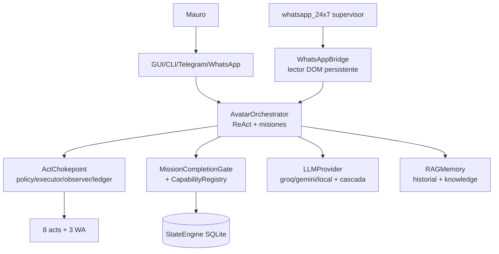

# AVATAR — Arquitectura objetivo

Principios: un escritor por estado; el modelo propone, el sistema dispone;
ningún éxito sin observación independiente; fallos ruidosos, nunca silenciosos;
seguridad por defecto (deny); nada de reescritura — migrar por costuras probadas.

## Contexto (Mermaid)

## Módulos y reglas de dependencia

| Módulo | Responsabilidad | Lee | Escribe | Prohibido |
|---|---|---|---|---|
| `interface`/`server.py`/`bridges` | Transporte + validación I/O | orquestador | nada directo | efectos fuera de chokepoint |
| `AvatarOrchestrator` | Loop, misiones, dispatch, gates | cognitivo, chokepoint, LLM, DB | misiones, acts (vía chokepoint) | auto-certificar |
| `ActChokepoint` | Único ejecutor de efectos | policy, executors, observers | tabla `acts` | importar cognitivo |
| Autoridad (`authority_core`, gate, registry, builder, verifier) | Prueba independiente | ledger, hechos físicos | evidencias admitidas | firmar sin observar |
| `StateEngine` | Persistencia + re-derivación | filas propias | todas sus tablas | confiar en firmas sin re-derivar |
| `LLMProvider` | Texto/tools de 6 proveedores | config, red/local | nada | exponer claves |
| `RAGMemory` | Historial + knowledge | DB/JSON | historial/knowledge | ser autoridad de hechos |
| Runner 24/7 | Supervisar el loop WA | bridge, heartbeat | heartbeat, cursor | responder por su cuenta |

## Tubería de ejecución y autoridad

`intención → plan → autorización (policy/consentimiento) → request → attempt →
respuesta tool → observación independiente → verificación → estado de misión`.
Estados distinguibles: propuesto, autorizado, intentado, ejecutado, observado,
verificado, completado. La autorización vive poco (por misión/ejecución), no se
reutiliza; el gate re-deriva siempre (veredicto firmado pero divergente = inerte).

## Misiones y memoria

Misión = fila SQLite + sello de requisitos; el estado terminal solo sale del gate.
Memoria separada por tipo: conversación (10 turnos al LLM), operacional (tablas),
knowledge (tópicos por palabras). `acts` es append-only y responde "¿qué hizo?".

## Routing y costos

Interfaz neutra (`generate_response_with_tools`); selección por `default_provider`;
fallback ciego a gemini (documentado como deuda) → reintento guiado → cascada local
opt-in con health-check. Sin techos de costo hoy: registrar uso por proveedor es
trabajo pendiente (roadmap R4).

## Seguridad y fallos

Fronteras: instrucciones del dueño ≠ texto web/comandos ajenos (UNTRUSTED);
proceso del agente ≠ verificador externo (inexistente: Modelo-B abierto);
secretos solo en `.env`/`config.json` gitignorados. Fallos: reintento acotado con
reparación, corte determinista (vacío×2, relleno×2), backoff con tope, stop-file,
denegación registrada. Nada destructivo sin confirmación.

## Migración (sin rewrite)

1. Podar muertos (`subagents`, `autoloop`, `closed_loop`, probe) tras confirmar 0 usos.
2. `ToolRegistry` como fuente del dispatch (hoy if/elif paralelo).
3. Logger estructurado con redacción (reemplaza prints; conserva `redact_secrets`).
4. `requirements.lock` + CI mínima (pytest).
5. Verificador externo solo si el modelo de amenaza lo exige (ADR previo).
6. STATUS.md único vivo; archivar `AVATAR_*.md` históricos a `docs/archive/`.

## ADRs requeridos

ADR-01 verificador out-of-process (sí/no/condiciones). ADR-02 event-sourcing vs
estado actual (recomendación: no migrar; `acts` append-only ya cubre la auditoría).
ADR-03 rewrite del orquestador (recomendación: no). ADR-04 vectorializar memoria
(solo con necesidad demostrada). ADR-05 monorepo con NEXUM (no mezclar).
