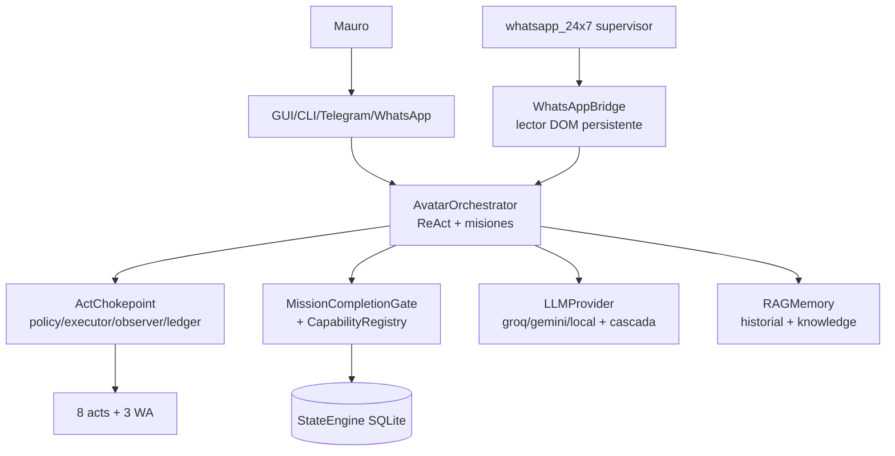

# AVATAR — Handover consolidado (Master 007)

Compilado 2026-09-28 desde docs/engineering/handover/. Fuente canonica: los 8 archivos individuales.


---

## Parte 1: AVATAR_CURSOR_START_HERE.md
# AVATAR — Empieza aquí (Cursor)

Repo: `B:\PROYECTOS ANTIGRAVITY\Avatar` (git propio, `main`). No lo copies ni lo
muevas; no es NEXUM.

## Orden de lectura

1. `CURSOR_MASTER_CONTEXT_PROMPT.md` — pégalo como primer mensaje.
2. `AVATAR_PROJECT_DEEP_AUDIT.md` — estado verificado con evidencia.
3. `AVATAR_ARCHITECTURE_TARGET.md` — a dónde va el sistema.
4. `AVATAR_ERROR_AND_RISK_REGISTER.md` — qué duele y su estado.
5. `AVATAR_IMPLEMENTATION_ROADMAP.md` — fases R0-R7 (empieza por R1).
6. `CURSOR_PROJECT_HANDOVER.md` — operación diaria, secretos, calidad.

## Primeras tareas (solo lectura)

1. `git status` + `git log --oneline -4` y confirma árbol limpio.
2. Corre la suite y confirma 497 passed.
3. Traza `POST /api/chat` → `process_user_input` → `chokepoint.perform` → ledger.
4. Lee `bridges/telegram_bridge.py:111,122` (bypass abierto) y propone R1 sin
   implementarlo aún.

No implementes nada amplio hasta validar el baseline y entender el roadmap.

---

## Parte 2: AVATAR_AUDIT_EXECUTIVE_SUMMARY.md
# AVATAR — Resumen ejecutivo para el dueño

**Qué es hoy:** un agente local funcional (497 tests verdes), con misiones
persistentes, control de efectos con auditoría, verificación anti-invenciones y
WhatsApp bidireccional probado en vivo. No es un chatbot ni está terminado.

**Qué funciona de verdad:** ejecutar y observar comandos/archivos; denegar lo externo
sin tu permiso; continuar trabajo interrumpido; hablarte por WhatsApp y responder;
cambiar de proveedor si uno cae (incluido modelo local gratis); decirte la verdad
cuando algo falla (tras las correcciones de este mes).

**Qué no funciona / incierto:** Telegram a medias (atajos sin registrar); sin
programador de tareas ni guardián nocturno; sin bitácora estructurada; 111 documentos
viejos que se contradicen; ante un atacante dentro del propio PC, sin defensa total
posible (límite físico, no bug).

**Riesgos serios:** secretos en plano si un agente improvisa archivos (ya ocurrió una
vez; red puesta); dos navegadores peleando por WhatsApp (candado puesto); cuotas
gratis que pueden cambiar.

**Reparar primero (R1-R2):** bypass Telegram, bitácora con redacción, candar
dependencias. Luego: guardián/scheduler (R3), costos por proveedor (R4), Telegram
Bot (R5). Verificador externo solo si decides el modelo de amenaza (R7).

**Cursor:** abre la carpeta exacta, verifica git+suite, pega el master prompt y
empieza por R1. Decisiones tuyas pendientes: servicio propio vs programador de
Windows (R3), alcance del verificador externo (R7), y archivar la papelería vieja.
Próximo hito realista: R1+R2 en 1-2 sesiones, R3 con tu decisión.

---

## Parte 3: AVATAR_PROJECT_DEEP_AUDIT.md
# AVATAR — Auditoría técnica profunda (v-Master-007)

Fecha: 2026-09-28. Auditor: OpenCode (Muse Spark). Idioma: español.
Alcance: solo lectura + tests seguros. **Código fuente no modificado.**
Raíz inspeccionada: `B:\PROYECTOS ANTIGRAVITY\Avatar` (verificada: existe).

## 1. Identidad y propósito

Avatar es un agente de IA soberano local (Windows, Python 3.12.8): orquestador ReAct
con misiones persistentes en SQLite, chokepoint de efectos con política, verificación
física anti-alucinación, 6 proveedores LLM y superficies GUI/CLI/Telegram/WhatsApp.
No es un chatbot: propone, ejecuta con herramientas, observa y verifica con evidencia.

## 2. Estado verificado (2026-09-28)

- Git: repo propio, rama `main`, 4 commits (`ca99bdc` inicial; `dbc97be` WhatsApp;
  `b56620d` 24/7; `4dc7514` Telegram+cerebro local). Árbol limpio.
- Suite: **497 passed, 0 failed en 143.08s** (`python -m pytest tests/ -q --tb=no
  -p no:cacheprovider`). 467 funciones `test_*` en 37 archivos (la diferencia con
  497 viene de herencia: `test_recovery.py` hereda 15 de Phase4).
- Python: 157 archivos `.py` propios; 307 archivos totales (sin `.git`, cachés ni perfil WA).
- Dependencias (`requirements.txt`, 6): requests, pydantic, rich, prompt_toolkit,
  colorama, google-generativeai. Sin lock file.
- Entradas: `server.py` (FastAPI, 9992 B), `main_gui.py`, `main.py` (230 B),
  `interface/cli.py`, `bridges/telegram_bridge.py`, `bridges/whatsapp_bridge.py`,
  `whatsapp_24x7.py`. `core/autoloop.py` existe pero nadie lo importa (muerto).
- Secretos: solo en `config.json` y `.env` locales (gitignored); plantillas
  `config.example.json` + `.env.example` versionadas. Sin valores en este informe.

## 3. Mapa del repositorio

```
core/orchestrator.py (1223 l.)      ReAct loop, misiones, dispatch, gates
core/act_chokepoint.py              11 acts, policy, executors, observers, ledger `acts`
core/state_db.py (1021 l.)          SQLite WAL: missions, planner_tasks, acts(vía chokepoint),
                                    evidences, gaps, history, capability_records
core/llm_provider.py (649+ l.)      6 adaptadores + facade con reparación y cascada
core/checkpoint_engine.py           PRE/POST/VERIFIED/UNCERTAIN + idempotencia
core/resume_engine.py               Evaluación + resume idempotente (conectado 2026-09)
core/cognitive/ (30 módulos)        Semántica, adaptativa, autoridad, recovery, anti-loop
core/rag_memory.py                  Búsqueda por palabras (NO vectorial) sobre StateEngine
bridges/                            telegram_bridge.py, whatsapp_bridge.py, whatsapp_reader.py
tools/                              shell/file/web/browser/screen/computer/audio/whatsapp
server.py / gui/ / interface/       FastAPI + PyWebView + CLI
tests/ (37 archivos)                Ver §6. memory/ = runtime (DB, perfil WA, knowledge)
```

## 4. Arquitectura real (flujos trazados por call-sites)

1. **Chat GUI** `server.py:124 /api/chat` → `orchestrator.process_user_input()` (§4.1).
2. **Turno** (`orchestrator.py:241+`): clasificar → crear Goal (l.251) → crear misión
   (l.260, `raise` si falla) → loop ReAct (máx 5/15): `generate_response_with_tools`
   → nativo / SAR-recuperado / provider_error / vacío (corte al 2º) →
   `_dispatch_native_tool` → `chokepoint.perform` (policy→executor→observer→ledger) →
   verificación física → reconciliación por gate (`_reconcile_mission`) → respuesta
   ejecutiva o escalado honesto.
3. **Terminal GUI** `server.py:166 /api/terminal/execute` → `chokepoint.perform(COMMAND)`
   directo, misión `gui-terminal`.
4. **WhatsApp**: webhook → mismo turno; loop 24/7 `whatsapp_24x7.py` → supervisor →
   `WhatsAppBridge.start_live_bridge` (lector DOM persistente, dedup, autorizados,
   observe, límites) → turno → `SEND_WHATSAPP`/`WHATSAPP_SEND` por chokepoint.
5. **Resume**: `orchestrator.resume_mission()` → `ResumeEngine` → dispatcher por
   chokepoint → gate → idempotente (test_21).
6. **Proveedores**: `default_provider` (groq) + fallback ciego a gemini + reintento
   guiado (tool desconocido / JSON truncado) + cascada local opt-in
   (`providers.local_fallback`, qwen3:8b verificado en vivo).

## 5. Capacidades: lo que sí / lo que no (con evidencia)

- VERIFICADO físicamente: misiones persistentes, chokepoint+ledger (126+ acts),
  COMMAND/WRITE observados, denegación externa sin consentimiento, resume idempotente,
  ida y vuelta WhatsApp con relectura, 6 providers conmutables, fallback local.
- PARCIAL: memoria "RAG" por palabras (`rag_memory.py:141`); capacidades de proveedor
  estáticas; fallback ciego a gemini; visión sin bucle cerrado al orquestador;
  YouTube por scraping; Telegram con bypasses (ver §7).
- AUSENTE: scheduler, watchdog/heartbeat de proceso (hay heartbeat de fichero del
  runner), multi-agent por decisión, UIA total, RAG vectorial.
- MUERTO (0 importadores): `core/subagents.py`, `core/autoloop.py`,
  `core/cognitive/closed_loop.py`, `core/cognitive/self_development_probe.py`.

## 6. Tests: qué prueban y sus límites

- Entradas reales: `test_acceptance_e2e.py` (ScriptedLLM, 15),
  `test_acceptance_surfaces.py` (TestClient HTTP, 15), `test_whatsapp_live_bridge.py`
  (loop con lector simulado, 15), `test_desktop_vision.py` (25, real),
  `test_browser_engine.py` (fixtures locales), `test_checkpoint_resume.py` (21).
- Autoridad adversarial: 003 (45), 004 (39), consolidación (39): forja, replay,
  substitution, mocks como evidencia — todo rechazado.
- Reglas de higiene verificadas: prohibición de mocks que afirman éxito
  (`test_forensic_repair_002`), aislamiento DB bajo pytest (`conftest.py` + `_TempWorld`),
  policies fijadas por test (no dependen del `config.json` real), `local_fallback`
  desactivado en tests de routing/f14.
- Límites honestos: sin LLM vivo (ScriptedLLM/fakes), sin web pública (localhost),
  sin WhatsApp real (dobles), 1 flaky ambiental conocido (ventanas de escritorio;
  pasa aislado). Lo no ejecutado se marca NO verificado.

## 7. Hallazgos históricos: estado actual

- Los 17 documentos §3.1 (technical_audit_report, PROJECT_MASTER, UNIT_001/002, …):
  **ninguno existe**; equivalentes cercanos en `docs/` y raíz (§1 del informe forense).
- "Strategic Review 005" como documento **no existe**; lo cercano es
  `docs/AUTHORITY_CONSOLIDATION_005_REPORT.md` (modelo de autoridad, sin código) y
  `INDEPENDENT_ARCHITECTURE_REVIEW_001.md` (27/09/2026, vigente).
- Sus afirmaciones §3.6, verificadas hoy: `current_goal` use-before-assignment
  **CORREGIDO** (`orchestrator.py:251` crea primero; l.268-273 propaga el error);
  bypass WhatsApp **corregido**, bypass Telegram **CONFIRMADO_ABIERTO**
  (`bridges/telegram_bridge.py:111,122` directos); entradas convergen en el
  orquestador **confirmado**; ~257 archivos entonces vs 307 hoy.
- UNIT-001/UNIT-002 (TypeScript/Postgres/Redis/Stripe/Pino): **cero evidencias** —
  pertenecen a otro proyecto (NEXUM). Avatar es Python; NEXUM solo aparece como
  texto dentro de `memory/state_engine.db` (contenido de misiones, no código).
- Logging: **sin logger estructurado** (36 `print` en `core/`, `logging` solo en
  `browser_controller.py` sin configurar); redacción solo ad-hoc en `/api/config`
  (`server.py:30-45`, extendida a `/api/config/update` en 2026-09 tras fuga real).
- Autoridad §3.5: forja/reúso/auto-afirmación **corregidas en Modelo-A** (frozen+HMAC,
  `PermissionError` en setters, ledger single-use, sello D-5 con `BLOCKED` ante
  manipulación); **abiertas por diseño ante Modelo-B** (atacante en el mismo proceso:
  sin garantía posible in-process, declarado en `authority_core.py:19-28` y
  `act_chokepoint.py:25-28`).

## 8. Deuda técnica y preguntas abiertas

Deuda: 111 `.md` (64 en raíz, sin STATUS único vivo); logging plano; ramas muertas sin
podar; `ToolRegistry` desconectado del dispatch real; `operating_mode` no expone todo;
sin `requirements.lock`; Task Scheduler como único watchdog externo.
Abiertas: repo NEXUM padre muestra `Avatar/` untracked (cosmético); modelo local lento
en CPU (~45s); cuota gratuita de proveedores sujeta a cambios; rediseño total de
Telegram pendiente (hay token en `.env`, scripts en `scratch/`).

Evidencia: citas con archivo:línea en este documento; comandos y salidas en §2;
histórico Git: `git log --oneline` (4 commits). Nada afirmado sin fuente.

---

## Parte 4: AVATAR_ARCHITECTURE_TARGET.md
# AVATAR — Arquitectura objetivo

Principios: un escritor por estado; el modelo propone, el sistema dispone;
ningún éxito sin observación independiente; fallos ruidosos, nunca silenciosos;
seguridad por defecto (deny); nada de reescritura — migrar por costuras probadas.

## Contexto (Mermaid)



## Módulos y reglas de dependencia

| Módulo | Responsabilidad | Lee | Escribe | Prohibido |
|---|---|---|---|---|
| `interface`/`server.py`/`bridges` | Transporte + validación I/O | orquestador | nada directo | efectos fuera de chokepoint |
| `AvatarOrchestrator` | Loop, misiones, dispatch, gates | cognitivo, chokepoint, LLM, DB | misiones, acts (vía chokepoint) | auto-certificar |
| `ActChokepoint` | Único ejecutor de efectos | policy, executors, observers | tabla `acts` | importar cognitivo |
| Autoridad (`authority_core`, gate, registry, builder, verifier) | Prueba independiente | ledger, hechos físicos | evidencias admitidas | firmar sin observar |
| `StateEngine` | Persistencia + re-derivación | filas propias | todas sus tablas | confiar en firmas sin re-derivar |
| `LLMProvider` | Texto/tools de 6 proveedores | config, red/local | nada | exponer claves |
| `RAGMemory` | Historial + knowledge | DB/JSON | historial/knowledge | ser autoridad de hechos |
| Runner 24/7 | Supervisar el loop WA | bridge, heartbeat | heartbeat, cursor | responder por su cuenta |

## Tubería de ejecución y autoridad

`intención → plan → autorización (policy/consentimiento) → request → attempt →
respuesta tool → observación independiente → verificación → estado de misión`.
Estados distinguibles: propuesto, autorizado, intentado, ejecutado, observado,
verificado, completado. La autorización vive poco (por misión/ejecución), no se
reutiliza; el gate re-deriva siempre (veredicto firmado pero divergente = inerte).

## Misiones y memoria

Misión = fila SQLite + sello de requisitos; el estado terminal solo sale del gate.
Memoria separada por tipo: conversación (10 turnos al LLM), operacional (tablas),
knowledge (tópicos por palabras). `acts` es append-only y responde "¿qué hizo?".

## Routing y costos

Interfaz neutra (`generate_response_with_tools`); selección por `default_provider`;
fallback ciego a gemini (documentado como deuda) → reintento guiado → cascada local
opt-in con health-check. Sin techos de costo hoy: registrar uso por proveedor es
trabajo pendiente (roadmap R4).

## Seguridad y fallos

Fronteras: instrucciones del dueño ≠ texto web/comandos ajenos (UNTRUSTED);
proceso del agente ≠ verificador externo (inexistente: Modelo-B abierto);
secretos solo en `.env`/`config.json` gitignorados. Fallos: reintento acotado con
reparación, corte determinista (vacío×2, relleno×2), backoff con tope, stop-file,
denegación registrada. Nada destructivo sin confirmación.

## Migración (sin rewrite)

1. Podar muertos (`subagents`, `autoloop`, `closed_loop`, probe) tras confirmar 0 usos.
2. `ToolRegistry` como fuente del dispatch (hoy if/elif paralelo).
3. Logger estructurado con redacción (reemplaza prints; conserva `redact_secrets`).
4. `requirements.lock` + CI mínima (pytest).
5. Verificador externo solo si el modelo de amenaza lo exige (ADR previo).
6. STATUS.md único vivo; archivar `AVATAR_*.md` históricos a `docs/archive/`.

## ADRs requeridos

ADR-01 verificador out-of-process (sí/no/condiciones). ADR-02 event-sourcing vs
estado actual (recomendación: no migrar; `acts` append-only ya cubre la auditoría).
ADR-03 rewrite del orquestador (recomendación: no). ADR-04 vectorializar memoria
(solo con necesidad demostrada). ADR-05 monorepo con NEXUM (no mezclar).

---

## Parte 5: AVATAR_ERROR_AND_RISK_REGISTER.md
# AVATAR — Registro de errores y riesgos (evidencia)

Estados: `CONFIRMED_OPEN` (abierto), `CONFIRMED_FIXED` (corregido),
`CONFIRMED_PARTIALLY_FIXED` (parcial), `NOT_REPRODUCED`, `HISTORICAL_ONLY`,
`BLOCKED_EXTERNAL/INFRASTRUCTURE`. Confianza: HIGH (reproducido), MEDIUM (traza),
LOW (histórico).

## Críticos y altos

| ID | Nombre | Sev | Estado | Evidencia / causa | Corrección y verificación |
|---|---|---|---|---|---|
| E-01 | Fuga de claves en `POST /api/config/update` | Alta | CONFIRMED_FIXED (HIGH) | `server.py:107` devolvía `config.json` crudo; probado con TestClient (5 secretos) | `redact_secrets` en la respuesta + `test_config_update_does_not_return_secrets_in_clear` |
| E-02 | Bypass Telegram fuera de chokepoint | Alta | CONFIRMED_OPEN (HIGH) | `bridges/telegram_bridge.py:111` `ScreenTool`, `:122` `AudioTool` directos | Pendiente: acts de observación (roadmap R2) |
| E-03 | Amenaza Modelo-B (mismo proceso) | Alta | Abierta por diseño (HIGH) | `authority_core.py:19-28`, `act_chokepoint.py:25-28`; HMAC/ledger no resisten código arbitrario local | Requiere verificador externo (ADR-01); sin él, solo Modelo-A |
| E-04 | Forja/reúso de autorización y evidencia | Alta | CONFIRMED_FIXED en Modelo-A (HIGH) | Suites 003/004/consolidación (129 tests): replay, substitution, mocks | `frozen+HMAC`, `PermissionError`, ledger single-use, re-derivación |
| E-05 | Sello de requisitos manipulable con resellado | Media | CONFIRMED_PARTIALLY_FIXED (MEDIUM) | `state_db.py:221-227` lo admite; detección → `BLOCKED`, no prevención | Solo proceso separado lo cierra |
| E-06 | `current_goal` sin asignar tragado por `except` | Alta | CONFIRMED_FIXED (HIGH) | Review-005 §3.6; hoy `orchestrator.py:251` crea primero y l.268-273 propaga | Flujo leído + suite verde |
| E-07 | Resume desconectado ("continúa mañana" imposible) | Alta | CONFIRMED_FIXED (HIGH) | 0 llamadas runtime en su día | `resume_mission()` + `POST /api/missions/resume` + test_21 |
| E-08 | Plantillas presentadas como éxito | Media | CONFIRMED_FIXED (HIGH) | "Auditoría…" hardcodeada; vacíos presentados como texto | Respaldo ejecutivo + `provider_empty` + corte×2 + truncado |
| E-09 | Relleno LIST_DIR/READ_FILE como avance | Media | CONFIRMED_FIXED (MEDIUM) | 126 acts de ruido en ledger real | Lectura ≠ completada + corte de racha + acts nativos WA |
| E-10 | Secretos en plano por agentes (`token.txt`) | Alta | CONFIRMED_FIXED (HIGH) | Avatar escribió el token del bot en raíz (46 chars) | Migrado a `.env`, archivos eliminados, gitignore blindado, pre-commit escaneado |

## Medios y bajos

| ID | Nombre | Estado | Evidencia |
|---|---|---|---|
| E-11 | Pelea por perfil Chromium (ventanas en blanco) | CONFIRMED_FIXED | Lock `PERFIL_OCUPADO` + barrido garantizado + navegador compartido (`whatsapp_reader.py`) |
| E-12 | Playwright sync dentro de loop asyncio | CONFIRMED_FIXED | `run_blocking` en hilo dedicado; probado `RESULT:OK` en loop |
| E-13 | Relectura ciega a emojis/espacios | CONFIRMED_FIXED | `_text_key` + prueba física |
| E-14 | Tests atados al config real | CONFIRMED_FIXED | Policies y `local_fallback` fijados por test |
| E-15 | `main_gui`/`autoloop`/subagentes muertos o sombra | HISTORICAL_ONLY (MEDIUM) | `main_gui.py` leído: daemons separados, sin shadowing; resto 0 importadores |
| E-16 | RAG por palabras, no vectorial | CONFIRMED_OPEN (HIGH) | `rag_memory.py:141`; además el tópico debe igualar la palabra (`whatsapp` ≠ `whatsapp-24-7`) |
| E-17 | Sin logger estructurado | CONFIRMED_OPEN (HIGH) | 36 prints en `core/`; UNIT-002 no existe aquí |
| E-18 | Sin scheduler/watchdog de proceso | CONFIRMED_OPEN (HIGH) | Solo heartbeat de fichero del runner; Task Scheduler externo |
| E-19 | Capacidades proveedor estáticas + fallback ciego | CONFIRMED_OPEN (MEDIUM) | Flags hardcodeados `llm_provider.py`; cascada local opt-in como mitigación |
| E-20 | 111 `.md` sin estado único vivo | CONFIRMED_OPEN (LOW) | 64 raíz + 44 `docs/`; v2.0 y este handover como candidatos a canónico |

## Verificación de cierre (todas)

Reproducir el síntoma original → aplicar corrección → test dedicado en verde →
suite completa verde → evidencia en ledger/log donde aplique. Ningún cierre por
"test pasa" sin reproducir primero.

---

## Parte 6: AVATAR_IMPLEMENTATION_ROADMAP.md
# AVATAR — Roadmap de implementación (secuenciado)

Orden: seguridad → rutas reales → estado/evidencia → integraciones → higiene → capacidades.

## R0 — Congelar garantías (hecho, mantener)

Objetivo: que nada futuro rompa lo verificado. Red: suites autoridad (129),
chokepoint AST, e2e/superficies, `test_21` idempotencia. Cierre: suite verde.

## R1 — Cerrar bypass Telegram (E-02)

Acts `SCREEN_CAPTURE`/`AUDIO_CONTROL` (READ) con observers físicos; `telegram_bridge`
por chokepoint; extender guard AST. Aceptación: enviar/capturar por Telegram deja act;
test AST en verde. Complejidad baja. Tokens: ~15-30k.

## R2 — Logger estructurado + lockfile (E-17)

Sustituir prints por logging JSON con redacción (conservar `redact_secrets`);
`requirements.lock`. Aceptación: sin secretos en logs; `pip install -r` reproducible.
Complejidad baja. Tokens: ~10-20k.

## R3 — Watchdog y scheduler (E-18)

`core/watchdog.py` (heartbeat, reinicio, re-resume) + `core/scheduler.py` o Task
Scheduler documentado. Aceptación: kill nocturno simulado con misión que continúa
sola. Complejidad media. Tokens: ~30-60k. Requiere decisión del dueño (servicio
propio vs programador del SO).

## R4 — Routing por salud y costos (E-19)

Health real que dirige tráfico, cascada configurable, registro de uso por proveedor,
techos de costo. Aceptación: caída de groq deriva sin intervención; uso visible.
Complejidad media. Tokens: ~25-50k.

## R5 — Integración Telegram Bot API (canal superior)

Token ya en `.env`; scripts en `scratch/` como referencia (NO producción: responden a
cualquiera). Polling con allowlist de chat, ledger y misma política WA. Aceptación:
ida y vuelta con relectura. Complejidad media. Tokens: ~30-60k. Requiere: probar con
el bot real del dueño.

## R6 — Higiene y consolidación (E-20, E-15)

Podar muertos, `ToolRegistry` como fuente del dispatch, STATUS.md único, archivar
históricos a `docs/archive/`. Aceptación: suite verde + árbol limpio. Tokens: ~15-30k.

## R7 — Verificador externo (E-03, solo si ADR-01 dice sí)

Proceso separado + IPC para Modelo-B. Es el único cambio arquitectónico mayor;
no iniciar sin ADR y sin amenaza que lo justifique. Complejidad alta. Tokens: 100k+.

## Puerta de cada fase

Reproducir síntoma → implementar → test dedicado → suite verde → evidencia en
ledger/log → actualizar este roadmap. Rollback: `git revert` (repo limpio, 4 commits).
Estimaciones de tokens marcadas como estimaciones, no compromisos.

---

## Parte 7: CURSOR_PROJECT_HANDOVER.md
# CURSOR — Handover práctico del proyecto Avatar

## 1. Abrir el repositorio exacto

1. Instala Cursor en Windows y ábrelo.
2. **File → Open Folder** → `B:\PROYECTOS ANTIGRAVITY\Avatar` (esa carpeta, no la
   padre `PROYECTOS ANTIGRAVITY`, que es otro repo —NEXUM—).
3. Confirma raíz: debes ver `core/`, `server.py`, `tests/`, `.git`, `README.md`.
4. Terminal integrado → `git status` (limpio esperado), `git log --oneline -4`
   (debe mostrar `4dc7514` arriba), `git branch` (`main`).
5. Comandos verificados: `python -m pytest tests/ -q --tb=line -p no:cacheprovider`
   (~2 min, 497 passed); `python server.py` (FastAPI :8000). No hay CI ni linter.

## 2. Modelos y cuenta

El catálogo del dueño (Grok/Claude/GPT/Gemini/Muse Spark) cambia; no lo fijes en
código. Para efectos locales usa el modelo que prefieras; el runtime de Avatar usa
sus propios proveedores (`config.json`, no tus credenciales de Cursor). Nunca pegues
API keys en prompts, reportes ni commits.

## 3. MCP, Skills, Hooks, Cloud Agents

Revisa cada integración antes de activarla (pueden ejecutar código). Para este repo:
no instales nada sin leerlo primero; los scripts de `scratch/` NO son producción.
**Cloud Agents no tocan tu escritorio**: WhatsApp/Telegram Playwright, Task Scheduler
y la DB local solo funcionan con agentes LOCALES. No ejecutes dos agentes sobre el
mismo árbol a la vez (uno edita, el otro espera).

## 4. Reglas de trabajo y secretos

- Rama `main`, commits pequeños con `git diff` revisado; nunca commitees `.env`,
  `config.json`, `memory/`, `token.txt` (gitignore los cubre; verifica con
  `git status` y escanea patrones `gsk_|AIza` antes de commitear).
- Empieza en solo-lectura; verifica baseline (suite verde) antes de implementar.
- Puertas de calidad: reproducir síntoma → test dedicado → suite verde → evidencia
  (ledger/log). Prohibido: mocks que afirman éxito, truncar errores, marcar fixed
  sin reproducir.
- Sensibles/externos/irreversibles (mensajes reales, credenciales, borrados,
  dependencias, red fuera de localhost): autorización explícita del dueño.

## 5. Dónde está cada cosa (ver `AVATAR_PROJECT_DEEP_AUDIT.md` §3-4)

Orquestador `core/orchestrator.py`, chokepoint `core/act_chokepoint.py`,
autoridad `core/cognitive/`, estado `core/state_db.py`, proveedores
`core/llm_provider.py`, puentes `bridges/`, GUI `server.py+gui/`, roadmap
`AVATAR_IMPLEMENTATION_ROADMAP.md` (este handover), errores
`AVATAR_ERROR_AND_RISK_REGISTER.md`.

---

## Parte 8: CURSOR_MASTER_CONTEXT_PROMPT.md
# CURSOR — Master context prompt (copiar y pegar)

Pégalo como primer mensaje al abrir `B:\PROYECTOS ANTIGRAVITY\Avatar` en Cursor:

---
Eres el ingeniero principal a cargo de AVATAR, agente de IA soberano local
(Python 3.12, Windows) en `B:\PROYECTOS ANTIGRAVITY\Avatar` (repo git propio,
rama `main`, NO el monorepo padre NEXUM).

Misión del dueño (Mauro): asistente autónomo local que comprende objetivos,
planifica, ejecuta con herramientas autorizadas, observa, verifica con evidencia
física, persiste misiones y rinde cuentas. Sin promesas imposibles.

ANTES DE IMPLEMENTAR NADA:
1. Lee en orden: `docs/engineering/handover/AVATAR_CURSOR_START_HERE.md`,
   `AVATAR_PROJECT_DEEP_AUDIT.md`, `AVATAR_ARCHITECTURE_TARGET.md`,
   `AVATAR_ERROR_AND_RISK_REGISTER.md`, `AVATAR_IMPLEMENTATION_ROADMAP.md`.
2. Verifica en el repo: `git status` limpio, `git log --oneline -4`, y corre la
   suite (`python -m pytest tests/ -q --tb=line -p no:cacheprovider`, ~2 min,
   esperado 497 passed). Si algo difiere, repórtalo, no lo maquilles.
3. Estado verificado que debes asumir: chokepoint con 11 acts y ledger append-only;
   autoridad Modelo-A sólida (HMAC/ledger/re-derivación) y Modelo-B abierto por
   diseño; bypass Telegram abierto (`bridges/telegram_bridge.py:111,122`); sin
   scheduler/watchdog; sin logger estructurado; 111 `.md` históricos sin canónico.

REGLAS:
- Una sola tarea del roadmap (R1 primero) con sus criterios de aceptación.
- Reproduce el síntoma, test dedicado, suite verde, evidencia en ledger/log.
- Prohibido: mocks que afirman éxito,auto-aprobar acciones sensibles, secretos en
  código/prompts/commits (`.env`, `config.json`, `memory/` gitignorados), tocar
  la DB de producción, mensajes reales sin autorización, reescribir módulos.
- Dudas de alto impacto → PARA y pide decisión al dueño con opciones y evidencia.

Tu primera respuesta debe ser: baseline verificado (o diferencias), documento
leído que más te sorprendió y por qué, y plan de R1 en 5 líneas.
---
